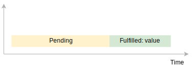
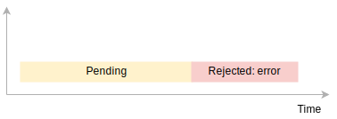

# ECMAScript-6 Basics

> *Click &#9733; if you like the project. Your contributions are heartily ♡ welcome.*

<br/>

## Related Topics

* *[HTML Basics](https://github.com/learning-zone/html-basics)*
* *[CSS Basics](https://github.com/learning-zone/css-basics)*
* *[JavaScript Basics](https://github.com/learning-zone/javascript-basics)*
* *[JavaScript ES6 Basics](https://github.com/learning-zone/javascript-es6-basics)*
* *[JavaScript ES6 Multiple Choice Questions](es6-mcq.md)*
* *[JavaScript Unit Testing](https://github.com/learning-zone/javascript-unit-testing)*
* *[JavaScript Coding Practice](https://github.com/learning-zone/javascript-coding-practice)*
* *[JavaScript Design Patterns](https://github.com/learning-zone/javascript-design-patterns)*
* *[Data Structure in JavaScript](https://github.com/learning-zone/javascript-data-structure)*

<br/>

## Table of Contents

* [Introduction](#-1-introduction)
* ES6 New Features
    * [let](#-21-let)
    * [let vs var](#-22-let-vs-var)
    * [const](#-23-const)
    * [Arrow Function](#-24-arrow-function)
    * [Default Function Parameters](#-25-default-function-parameters)
    * [Rest Parameter](#-26-rest-parameter)
    * [Spread Operator](#-27-spread-operator)
    * [for…of](#-28-forof)
    * [Binary and Octal literals](#-29-binary-and-octal-literals)
    * [Template literals](#-210-template-literals)
    * [Enhanced Object literals](#-211-Enhanced-object-literals)
* Destructuring
    * [Array Destructuring](#-31-array-destructuring)
    * [Object Destructuring](#-32-object-destructuring)
* ES6 Modules
    * [ES6 modules](#-4-es6-modules)
* ES6 Classes
    * [Classes](#-51-classes)
    * [Getters and Setters](#-52-getters-and-setters)
    * [Class Expression](#-53-class-expression)
    * [Static methods](#-54-static-methods)
    * [Static Properties](#-55-static-properties)
    * [Computed property](#-56-computed-property)
    * [Inheritance](#-57-inheritance)
    * [new.target](#-58-newtarget)
    * [Private Class Fields and Methods](#-59-private-class-fields-and-methods)
* Symbol
    * [Symbol](#-6-symbol)
* Iterators & Generators
    * [Iterators](#-71-iterators)
    * [Generators](#-72-generators)
    * [yield](#-73-yield)
    * [yield*](#-74-yield-1)
* Promises
    * [Promises](#-81-promises)
    * [Promise chaining](#-82-promise-chaining)
    * [Promise.all()](#-83-promiseall)
    * [Promise.race()](#-84-promiserace)
    * [Promise Error Handling](#-85-promise-error-handling)
    * [async / await](#-86-async--await)
    * [Promise.allSettled()](#-87-promiseallsettled)
    * [Promise.any()](#-88-promiseany)
    * [Promise.withResolvers()](#-89-promisewithresolvers)
* ES6 Collections
    * [Set](#-91-set)
    * [Weakset](#-92-weakset)
    * [Map](#-93-map)
    * [Weakmap](#-94-weakmap)
* Array Extensions
    * [Array.of()](#-101-arrayof)
    * [Array.from()](#-102-arrayfrom)
    * [Array.find()](#-103-arrayfind)
    * [Array.findIndex()](#-104-arrayfindindex)
    * [Array.fill()](#-105-arrayfill)
    * [Array.copyWithin()](#-106-arraycopywithin)
    * [Array.keys()](#-107-arraykeys)
    * [Array.values()](#-108-arrayvalues)
    * [Array.entries()](#-109-arrayentries)
    * [Array.flat()](#-1010-arrayflat)
    * [Array.flatMap()](#-1011-arrayflatmap)
    * [Array.at()](#-1012-arrayat)
    * [Array.findLast()](#-1013-arrayfindlast)
    * [Array.findLastIndex()](#-1014-arrayfindlastindex)
    * [Array.toSorted(), toReversed(), toSpliced(), with()](#-1015-arraytoSorted-toReversed-toSpliced-with)
* Object Extensions
    * [Object.assign()](#-111-objectassign)
    * [Object.is()](#-112-objectis)
    * [Object.keys()](#-113-objectkeys)
    * [Object.values()](#-114-objectvalues)
    * [Object.entries()](#-115-objectentries)
    * [Object.freeze()](#-116-objectfreeze)
    * [Object.seal()](#-117-objectseal)
    * [Object.fromEntries()](#-118-objectfromentries)
    * [Object.hasOwn()](#-119-objecthasown)
* String Extensions
    * [String.startsWith()](#-121-stringstartswith)
    * [String.endsWith()](#-122-stringendswith)
    * [String.includes()](#-123-stringincludes)
    * [String.repeat()](#-124-stringrepeat)
    * [String.padStart() and String.padEnd()](#-125-stringpadstart-and-stringpadend)
    * [String.trimStart() and String.trimEnd()](#-126-stringtrimstart-and-stringtrimend)
    * [String.replaceAll()](#-127-stringreplaceall)
    * [String.at()](#-128-stringat)
* Proxy & Reflection
    * [Proxy](#-131-proxies)
    * [Reflection](#-132-reflect)
* Number Extensions
    * [Number.isInteger()](#-151-numberisinteger)
    * [Number.isFinite()](#-152-numberisfinite)
    * [Number.isNaN()](#-153-numberisnan)
    * [Number.EPSILON](#-154-numberepsilon)
* Math Extensions
    * [Math.sign()](#-161-mathsign)
    * [Math.trunc()](#-162-mathtrunc)
    * [Math.cbrt()](#-163-mathcbrt)
    * [Math.hypot()](#-164-mathhypot)
* Miscellaneous Features
    * [Optional Chaining (?.)](#-141-optional-chaining-)
    * [Nullish Coalescing (??)](#-142-nullish-coalescing-)
    * [Logical Assignment Operators](#-143-logical-assignment-operators)
    * [Unicode](#-144-unicode)
    * [Proper Tail calls](#-145-proper-tail-calls)
* ES2025 New Features
    * [Iterator Helpers](#-171-iterator-helpers)
    * [New Set Methods](#-172-new-set-methods)
    * [Promise.try()](#-173-promisetry)
    * [Import Attributes](#-174-import-attributes)
    * [RegExp Duplicate Named Capture Groups](#-175-regexp-duplicate-named-capture-groups)
    * [Float16Array](#-176-float16array)
    * [RegExp.escape()](#-177-regexpescape)
    * [Error.isError()](#-178-erroriserror)
    * [Atomics.pause()](#-179-atomicspause)

<br/>


## # 1. Introduction

JavaScript ES6 (also known as ECMAScript 2015 or ECMAScript 6) was a major update to JavaScript introduced in 2015, bringing modern features like `let`/`const`, arrow functions, classes, modules, and more. Since ES6, ECMAScript has followed a yearly release schedule — with ES2016, ES2017, and so on — up to the latest **ECMAScript 2025 (ES16)**, finalized in June 2025.

ECMAScript is the standard that JavaScript programming language uses. ECMAScript provides the specification on how JavaScript programming language should work.

<div align="right">
    <b><a href="#table-of-contents">↥ back to top</a></b>
</div>

## # 2.1. let

ES6 provides a new way of declaring a variable by using the `let` keyword. The `let` keyword is similar to the `var` keyword, except that these variables are **blocked-scope**.

**Syntax:**

```js
let variable_name;
```

In JavaScript, blocks are denoted by curly braces `{}` , for example, the `if else`, `for`, `do while`, `while`, `try catch` and so on.

**Example:**

```js
let x = 10;
if (x === 10) {
  let x = 20;
  console.log(x); // 20:  reference x inside the block
}
console.log(x); // 10: reference at the begining of the script

// Output:
20
10
```

Because the `let` keyword declares a block-scoped variable, the `x` variable inside the `if` block is a **new variable** and it shadows the `x` variable declared at the top of the script. Therefore, the value of `x` in the console is 20.

**&#9885; [Try this example on CodeSandbox](https://codesandbox.io/s/es6-let-zikqqb?file=/src/index.js)**

<div align="right">
    <b><a href="#table-of-contents">↥ back to top</a></b>
</div>

## # 2.2. let vs var

The `var` variables belong to the global scope when you define them outside a function. When you declare a variable inside a function using the `var` keyword, the scope of the variable is local. For example:

```js
function increase() {
    var counter = 10;
}
console.log(counter); // cannot access the counter variable here

// Output
// ReferenceError: counter is not defined
```

Here, the counter variable is local to the increase() function. It cannot be accessible outside of the function.

The following example displays four numbers from 0 to 4 inside the loop and the number 5 outside the loop.

```js
for (var i = 0; i < 3; i++) {
  console.log("Inside the loop:", i);
}

console.log("Outside the loop:", i);

// Output:
Inside the loop: 0 
Inside the loop: 1 
Inside the loop: 2 
Outside the loop: 3
```

Here, the i variable is a global variable. Therefore, it can be accessed from both inside and after the for loop.

The following example uses the `let` keyword instead of the `var` keyword:

```js
for (let i = 0; i < 3; i++) {
  console.log("Inside the loop:", i);
}

console.log("Outside the loop:", i);

// Output
Inside the loop: 0
Inside the loop: 1
Inside the loop: 2

Uncaught ReferenceError: i is not defined
```

Here, the variable **i** is blocked scope. It means that the variable **i** only exists and can be accessible inside the for loop block.

**&#9885; [Try this example on CodeSandbox](https://codesandbox.io/s/es6-let-vs-var-yvu11z)**

<div align="right">
    <b><a href="#table-of-contents">↥ back to top</a></b>
</div>

## # 2.3. const

ES6 provides a new way of declaring a constant by using the `const` keyword. The `const` keyword creates a **read-only** reference to a value.

```js
const CONSTANT_NAME = value;
```

Like the `let` keyword, the `const` keyword declares **blocked-scope** variables. However, the **block-scoped** variables declared by the `const` keyword can\'t be **reassigned**.

```js
const RATE = 0.1;
RATE = 0.2; // TypeError
```

The const keyword ensures that the variable it creates is read-only. However, it doesn’t mean that the actual value to which the const variable reference is immutable. For example:

```js
const person = { age: 20 };
console.log(person.age); // 20

person.age = 30; // OK
console.log(person.age); // 30
```

Even though the person variable is a constant, you can change the value of its property.

However, you cannot reassign a different value to the person constant like this:

```js
person = { age: 40 }; // TypeError
```

If you want the value of the person object to be immutable, you have to freeze it by using the Object.freeze() method:

```js
const person = Object.freeze({age: 20});
person.age = 30; // TypeError
```

*Note: `Object.freeze()` is shallow, meaning that it can freeze the properties of the object, not the objects referenced by the properties.*

**&#9885; [Try this example on CodeSandbox](https://codesandbox.io/s/es6-const-prej6w)**

<div align="right">
    <b><a href="#table-of-contents">↥ back to top</a></b>
</div>

## # 2.4. Arrow Function

The Arrow function provides a more concise syntax for writing function expressions by opting out the function and return keywords using fat arrow(`=>`) notation.

**Syntax:**

```js
let myFunction = (arg1, arg2, ...argN) => expression
```

```js
// Function Expression 
let add = function (x, y) {
  return x + y;
};
console.log(add(10, 20)); // 30
```

The above function can be written as

```js
// Arrow functions
let add = (x, y) => x + y;
console.log(add(10, 20)); // 30
```

**Example 01:** Arrow Function with No Argument

If a function doesn\'t take any argument, then you should use empty parentheses.

```js
let greet = () => console.log('Hello');
greet(); // Hello
```

**Example 02:** Arrow Function with One Argument

If a function has only one argument, you can omit the parentheses.

```js
let greet = x => console.log(x);
greet('Hello'); // Hello 
```

**Example 03:** Arrow Function as an Expression

You can also dynamically create a function and use it as an expression.

```js
let age = 25;

let welcome = (age < 18) ?
  () => console.log('Baby') :
  () => console.log('Adult');

welcome(); // Adult
```

**Example 04:** Multiline Arrow Functions

If a function body has multiple statements, you need to put them inside curly brackets `{}`.

```js
let area = (r) => {
  const pi = 3.14;
  return pi * r * r;
}

let result = area(10);
console.log(result); // 314
```

*Note: Unlike regular functions, arrow functions do not have their own `this`. The value of `this` inside an arrow function remains the same throughout the lifecycle of the function and is always bound to the value of `this` in the closest non-arrow parent function.*

**&#9885; [Try this example on CodeSandbox](https://codesandbox.io/s/es6-arrow-function-yl7oqo?file=/src/index.js)**

<div align="right">
    <b><a href="#table-of-contents">↥ back to top</a></b>
</div>

## # 2.5. Default Function Parameters

Default parameters allow named parameters of a function to be initialized with default values if no value or undefined is passed.

**Syntax:**

```js
function fn(param1=default1, param2=default2,..) {
  // ...
}
```

Prior to ES6, you need check for undefined values and provide the default value for undefined values using if/else or ternary operator

```js
function sum(a, b) {
  a = (typeof a !== 'undefined') ? a : 10;
  b = (typeof b !== 'undefined') ? b : 20;
  return a + b;
}

console.log(sum()); // 30
console.log(sum(20)); // 40
```

In ES6, these checks can be avoided using default parameters

```js
function sum(a = 10, b = 20) {
  return a + b;
}

console.log(sum()); // 30
console.log(sum(20)); // 40
console.log(sum(20, 30)); // 50
```

**&#9885; [Try this example on CodeSandbox](https://codesandbox.io/s/es6-default-parameters-8uu0m8?file=/src/index.js)**

<div align="right">
    <b><a href="#table-of-contents">↥ back to top</a></b>
</div>

## # 2.6. Rest Parameter

The rest parameter is used to represent an indefinite number of arguments as an array. The important point here is only the function\'s last parameter can be a "rest parameter".

This feature has been introduced to reduce the boilerplate code that was induced by the arguments.

**Example:**

```js
function sum(...args) {
  return args.reduce((previous, current) => {
    return previous + current;
  });
}

console.log(sum(10)); // 10
console.log(sum(10, 20)); // 30
console.log(sum(10, 20, 30)); // 60
```

**&#9885; [Try this example on CodeSandbox](https://codesandbox.io/s/es6-rest-parameters-w8zy28?file=/src/index.js)**

<div align="right">
    <b><a href="#table-of-contents">↥ back to top</a></b>
</div>

## # 2.7. Spread Operator

The spread operator allows you to spread out elements of an iterable object such as an **array**, **map**, or **set**.

**Example:**

```js
const odd = [1, 3, 5];
const combined = [2, 4, 6, ...odd];

console.log(combined); // [ 2, 4, 6, 1, 3, 5 ]
```

JavaScript spread operator and array manipulation

**1. Constructing array literal:**

The spread operator allows to insert another array into the initialized array when you construct an array using the literal form.

```js
let initialChars = ['A', 'B'];
let chars = [...initialChars, 'C', 'D'];

console.log(chars); // ["A", "B", "C", "D"]
```

**2. Concatenating arrays:**

```js
let numbers = [10, 20];
let moreNumbers = [30, 40];
let allNumbers = [...numbers, ...moreNumbers];

console.log(allNumbers); // [10, 20, 30, 40]
```

**3. Copying an array:**

```js
let scores = [80, 70, 90];
let copiedScores = [...scores];

console.log(copiedScores); // [80, 70, 90]
```

**&#9885; [Try this example on CodeSandbox](https://codesandbox.io/s/es6-spread-operator-0jh98u)**

<div align="right">
    <b><a href="#table-of-contents">↥ back to top</a></b>
</div>

## # 2.8. For..of

The `for...of` statement creates a loop iterating over **iterable objects**, including: built-in `String`, `Array`, array-like objects (e.g., `arguments` or `NodeList`), `TypedArray`, `Map`, `Set`, and user-defined iterables.

It invokes a custom iteration hook with statements to be executed for the value of each distinct property of the object.

**Syntax:**

```js
for (variable of iterable) {
   // ...
}
```

**Example 01:** Iterating over an Array

```js
const iterable = [10, 20, 30];

for (const value of iterable) {
  console.log(value);
}

// Output
10
20
30
```

**Example 02:** Iterating over a String

```js
const iterable = 'Hello';

for (const value of iterable) {
  console.log(value);
}

// Output
"H"
"e"
"l"
"l"
"o"
```

**Example 03:** Iterating over a Map

```js
const iterable = new Map([['A', 10], ['B', 20], ['C', 30]]);

for (const [key, value] of iterable) {
  console.log(key + " -> " + value);
}

// Output
A -> 10
B -> 20
C -> 30
```

**Example 04:** Iterating over a Set

```js
const iterable = new Set([10, 10, 20, 20, 30, 30]);

for (const value of iterable) {
  console.log(value);
}

// Output
10
20
30
```

**&#9885; [Try this example on CodeSandbox](https://codesandbox.io/s/es6-for-of-ltt89x?file=/src/index.js)**

<div align="right">
    <b><a href="#table-of-contents">↥ back to top</a></b>
</div>

## # 2.9. Binary and Octal literals

ES5 provided numeric literals in octal (prefix 0), decimal (no prefix), and hexadecimal ( 0x) representation. ES6 added support for binary literals and improvements on octal literals.

**1. Binary literals:**

Prior to ES5, JavaScript didn\'t provide any literal form of binary numbers. So you need to use a binary string with the help of `parseInt()`

```js
const num = parseInt('111', 2);
console.log(num); // 7
```

Whereas ES6 added support for binary literals using the **0b** prefix followed by a sequence of binary numbers (i.e, 0 and 1).

```js
const num = 0b111;
console.log(num); // 7
```

**2. Octal literals:**

In ES5, to represent an octal literal, you use the zero prefix (0) followed by a sequence of octal digits (from 0 to 7).

```js
const num = 055;
console.log(num); // 45

// Note: Legacy octal literals are not allowed in strict mode
```

ES6 represents the octal literal by using the prefix **0o** followed by a sequence of octal digits from 0 through 7.

```js
let num = 0o10;
console.log(num); // 8
```

**&#9885; [Try this example on CodeSandbox](https://codesandbox.io/s/es6-binary-literals-mllutq?file=/src/index.js)**

<div align="right">
    <b><a href="#table-of-contents">↥ back to top</a></b>
</div>

## # 2.10. Template literals

Template literals allows you to work with strings in a new way compared to ES5. These are just string literals allowing embedded expressions denoted by the dollar sign and curly braces **${expression}**. These literals are enclosed by the backtick character instead of double or single quotes.

**Example:**

```js
let str = "World";
let message = `Hello ${str}`;

console.log(message); // Hello World
```

**Multiline Strings:**

```js
let msg = 'Multiline \n\
string';

console.log(msg);

// Multiline
// string
```

**Tagged Templates:**

A template tag carries the transformation on the template literal and returns the result string.

It can be used in creating components in `CSS-In-JS` styled components to use across the application

```js
function tag(strings) {
  console.log(strings.raw[0]); 
}

tag`Hello World`;

// Output
Hello World
```

**&#9885; [Try this example on CodeSandbox](https://codesandbox.io/s/es6-template-literals-d005t4?file=/src/index.js)**

<div align="right">
    <b><a href="#table-of-contents">↥ back to top</a></b>
</div>

## # 2.11. Enhanced Object literals

The object literal is one of the most popular patterns for creating objects in JavaScript. Object literals are extended to support setting the prototype at construction, defining methods, making super calls, and computing property names with expressions

The important enhancements of object literals are,

**Property Shorthand:**

Object\'s properties are often created from variables with the same name.

Let\'s see the ES5 representation

```js
var a = 1, b = 2, c = 3;
var obj = {
    a: a,
    b: b,
    c: c
  };
console.log(obj);

// Output
// {a: 1, b: 2, c: 3}
```

and it can be represented in a shorter syntax as below,

```js
let a = 1, b = 2, c = 3;
let obj = {
    a,
    b,
    c
  };
console.log(obj);

// Output
{a: 1, b: 2, c: 3}
```

**Method Shorthand:**

Prior to ES6, when defining a method for an object literal, you need to specify the name and full function definition

```js
let server = {
  name: "Server",
  restart: function () {
    console.log("The" + this.name + " is restarting...");
  }
};
server.restart();

// Output
The Server is restarting... 
```

This can be avoided in ES6,

```js
let server = {
  name: "Server",
  restart() {
    console.log("The " + this.name + " is restarting...");
  }
};
server.restart();

// Output
The Server is restarting... 
```

**Computed Property Names:**

In ES5, it wasn\'t possible to use a variable for a key name during object creation stage.

```js
var key = "three",
  obj = {
    one: 10,
    two: 20
  };
obj[key] = 30;
```

Object keys can be dynamically assigned in ES6 by placing an expression in square brackets([])

```js
const key = "three",
  computedObj = {
    one: 10,
    two: 20,
    [key]: 30
  };
console.log(computedObj.one);

// Output
10
```

**&#9885; [Try this example on CodeSandbox](https://codesandbox.io/s/es6-object-literals-byphgz?file=/src/index.js)**

<div align="right">
    <b><a href="#table-of-contents">↥ back to top</a></b>
</div>

## # 3.1 Array Destructuring

ES6 provides a new feature called destructing assignment that allows you to destructure properties of an object or elements of an array into individual variables.

**Basic variable assignment:**

```js
const keys = ["one", "two", "three"];
const [red, yellow, green] = keys;

console.log(red); // one
console.log(yellow); // two
console.log(green); // three
```

**Assignment separate from declaration:**

```js
const [a, b] = [10, 20];

console.log(a); // 10
console.log(b); // 20
```

**Array destructuring and Default values:**

```js
const [x = 10, y = 20] = [30];

console.log(x); // 30
console.log(y); // 20
```

**Swapping variables:**

```js
let a = 10, 
    b = 20;

[a, b] = [b, a];

console.log(a); // 20
console.log(b); // 10
```

**Assigning the rest of an array to a variable:**

```js
const [a, ...b] = [1, 2, 3];

console.log(a); // 1
console.log(b); // [2, 3]
```

**Functions that return multiple values:**

```js
function calculate(a, b) {
  return [a + b, a - b, a * b];
}

let [sum, difference, multiplication] = calculate(20, 10);

console.log(sum, difference, multiplication); // 30, 10, 200
```

**&#9885; [Try this example on CodeSandbox](https://codesandbox.io/s/es6-array-destructuring-0k5c35?file=/src/index.js)**

<div align="right">
    <b><a href="#table-of-contents">↥ back to top</a></b>
</div>

## # 3.2. Object Destructuring

ES6 introduces the object destructuring syntax that provides an alternative way to assign properties of an object to variables.

**Syntax:**

```js
let { property1: variable1, property2: variable2 } = object;
```

**Simple assignment:**

```js
const num = { x: 10, y: 20 };
const { x, y } = num;

console.log(x); // 10
console.log(y); // 20
```

**Basic Object destructuring assignment:**

```js
const employee = {
  eId: "12345",
  name: "Dushyant Meena",
  email: "dushyant.meena@email.com"
};
const { eId, name, email } = employee;

console.log(eId); // 12345
console.log(name); // Dushyant Meena
console.log(email); // dushyant.meena@email.com
```

**Object destructuring and default values:**

```js
const { q = 10, w = 20 } = { e: 30 };

console.log(q); // 10
console.log(w); // 20
```

**Assigning new variable names:**

```js
const number = { x: 10, y: 20 };
const { x: val1, y: val2 } = number;

console.log(val1); // 10
console.log(val2); // 20
```

**Assignment without declaration:**

```js
let firstName, lastName;
({ firstName, lastName } = { firstName: "Gauri", lastName: "Pratima" });

console.log(firstName); // Gauri
console.log(lastName); // Pratima
```

**Object destructuring and rest operator:**

```js
let { a, b, ...args } = { a: 10, b: 20, c: 30, d: 40, e: 50 };

console.log(a);
console.log(b);
console.log(args);

// Output
10
20
{ c: 30, d: 40, e: 50 }
```

**Assigning new variable names and providing default values simultaneously:**

```js
const { a: num1 = 10, b: num2 = 20 } = { a: 30 };

console.log(num1); // 30
console.log(num2); // 20
```

**&#9885; [Try this example on CodeSandbox](https://codesandbox.io/s/es6-object-destructuring-ecncqm?file=/src/index.js)**

<div align="right">
    <b><a href="#table-of-contents">↥ back to top</a></b>
</div>

## # 4. ES6 modules

An ES6 module is a JavaScript file that executes in strict mode only. It means that any variables or functions declared in the module won\'t be added automatically to the global scope.

ES6 has provided the built-in support for modules. Everything inside a module is private by default. Public variables, functions and classes are exposed using `export` statement and import the same using `import` statement.

**Export Statement:**

There are two types of exports:

**1. Named Exports:**

You can export each element or a single export statement to export all the elements at once

```js
// module "my-module.js"
const PI = Math.PI;

function add(...args) {
  return args.reduce((num, tot) => tot + num);
}

function multiply(...args) {
  return args.reduce((num, tot) => tot * num);
}

// private function
function print(msg) {
  console.log(msg);
}

export { PI, add, multiply };
```

**2. Default Exports:**

If we want to export a single value, you could use a default export

```js
// module "my-module.js"
export default function add(...args) {
  return args.reduce((num, tot) => tot + num);
}
```

**Import Statement:**

The static import statement is used to import read only live bindings which are exported by another module.

There are many variations of import scenarios as below,

```js
// 1. Import an entire module\'s contents
import * as name from "my-module";

//2.Import a single export from a module
import { export1 } from "my-module";

//3.Import multiple exports from a module
import { export1 , export2 } from "my-module";

//4.Import default export from a module
import defaultExport from "my-module";

//5.Import an export with an alias
import { export1 as alias1 } from "my-module";
```

<div align="right">
    <b><a href="#table-of-contents">↥ back to top</a></b>
</div>

## # 5.1. Classes

ES6 Classes formalize the common JavaScript pattern of simulating class-like inheritance hierarchies using functions and prototypes. It support prototype-based inheritance, constructors, super calls, instance and static methods.

**Example:**

```js
/**
 * ES6 Class
 */
class Person {
  constructor(name) {
    this.name = name;
  }
  getName() {
    return this.name;
  }
}

let person = new Person("Prasad Shashi");
console.log(person.getName()); // "Prasad Shashi"
```

**&#9885; [Try this example on CodeSandbox](https://codesandbox.io/s/es6-class-70hkd7)**

<div align="right">
    <b><a href="#table-of-contents">↥ back to top</a></b>
</div>

## # 5.2. Getters and Setters

The accessor properties are methods that get or set the value of an object. For that, we use these two keywords:

* `get` - to define a getter method to get the property value
* `set` - to define a setter method to set the property value

**Example:**

```js
/**
 * Getters and Setters
 */
class Person {
  constructor(name) {
    this.name = name;
  }
  get name() {
    return this._name;
  }
  set name(name) {
    this._name = name;
  }
}

let person = new Person("Mala Amar");
console.log(person.name); // "Mala Amar"
```

*Note: These setter and getter allow you to use the properties directly ( without using the parenthesis )*

**&#9885; [Try this example on CodeSandbox](https://codesandbox.io/s/es6-getters-and-setters-ugb9jx?file=/src/index.js)**

<div align="right">
    <b><a href="#table-of-contents">↥ back to top</a></b>
</div>

## # 5.3. Class expressions

A class expression is another way to define a class. Class expressions can be named or unnamed. The name given to a named class expression is local to the class\'s body. However, it can be accessed via the name property.

**Example:**

```js
/**
 * Unnamed Class
 */
let Person = class {
  constructor(name) {
    this.name = name;
  }
  getName() {
    return this.name;
  }
};

let person = new Person("Anjali Durga");
console.log(person.getName()); // "Anjali Durga"
```

**&#9885; [Try this example on CodeSandbox](https://codesandbox.io/s/es6-class-expressions-ofbg0i)**

<div align="right">
    <b><a href="#table-of-contents">↥ back to top</a></b>
</div>

## # 5.4. Static methods

The static keyword defines a static method or property for a class, or a class static initialization block. Neither static methods nor static properties can be called on instances of the class. Instead, they\'re called on the class itself.

Static methods are often utility functions, such as functions to create or clone objects, whereas static properties are useful for caches, fixed-configuration, or any other data you don\'t need to be replicated across instances.

**Example:**

```js
/**
 * Static methods
 */
class Person {
  constructor(name) {
    this.name = name;
  }

  static staticMethod(gender) {
    let name = gender === "male" ? "Aryan Sarin" : "Manju Soni";
    return new Person(name);
  }
}

let anonymous = Person.staticMethod("male");
console.log(anonymous); // Person {name: "Aryan Sarin"}
```

**&#9885; [Try this example on CodeSandbox](https://codesandbox.io/s/es6-static-methods-3tf3li?file=/src/index.js)**

<div align="right">
    <b><a href="#table-of-contents">↥ back to top</a></b>
</div>

## # 5.5. Static Properties

Like a static method, a static property is shared by all instances of a class. To define static property, you use the static keyword followed by the property name like this:

**Example:**

```js
/**
 * Static Properties
 */
class Item {
  constructor(name, quantity) {
    this.name = name;
    this.quantity = quantity;
    this.constructor.count++;
  }
  // Static Properties
  static count = 0;

  // Static Method
  static getCount() {
    return Item.count++;
  }
}

let pen = new Item("Pen", 5);
let notebook = new Item("notebook", 10);

console.log(Item.getCount()); // 2
```

**&#9885; [Try this example on CodeSandbox](https://codesandbox.io/s/es6-static-properties-xc03d4)**

<div align="right">
    <b><a href="#table-of-contents">↥ back to top</a></b>
</div>

## # 5.6. Computed Property

ES6 "Computed Property" feature allows you to have an expression in brackets `[]` (a piece of code that results in a single value like a variable or function invocation) be computed as a property name on an object.

**Example:**

```js
/**
 * Computed Property
 */
let propName = "fullName";

class Person {
  constructor(firstName, lastName) {
    this.firstName = firstName;
    this.lastName = lastName;
  }
  get [propName]() {
    return `${this.firstName} ${this.lastName}`;
  }
}

let person = new Person("Sharma", "Peri");
console.log(person.fullName);

// Output
Sharma Peri
```

**&#9885; [Try this example on CodeSandbox](https://codesandbox.io/s/es6-computed-property-ns52qr?file=/src/index.js)**

<div align="right">
    <b><a href="#table-of-contents">↥ back to top</a></b>
</div>

## # 5.7. Inheritance

To create a class inheritance, use the `extends` keyword. A class created with a class inheritance inherits all the methods from another class. The `super()` method in the constructor is used to access all parent\'s properties and methods that are used by the derived class.

**Example:**

```js
/**
 * Inheritance
 */

// Parent Class
class Vehicle {
  constructor(name, type) {
    this.name = name;
    this.type = type;
  }

  getName() {
    return this.name;
  }

  getType() {
    return this.type;
  }
}
// Child Class
class Car extends Vehicle {
  constructor(name) {
    super(name, "car");
  }

  getName() {
    return "It is a car: " + super.getName();
  }
}
let car = new Car("Tesla");

console.log(car.getName()); // It is a car: Tesla
console.log(car.getType()); // car
```

**&#9885; [Try this example on CodeSandbox](https://codesandbox.io/s/es6-inheritance-vposow)**

<div align="right">
    <b><a href="#table-of-contents">↥ back to top</a></b>
</div>

## # 5.8. new.target

The `new.target` pseudo-property lets you detect whether a function or constructor was called using the **new** operator. In constructors and functions invoked using the new operator, `new.target` returns a reference to the constructor or function. In normal function calls, `new.target` is undefined.

**Example:**

```js
/**
 * new.target
 */
class Person {
  constructor(name) {
    this.name = name;
    console.log(new.target.name);
  }
}

class Employee extends Person {
  constructor(name, title) {
    super(name);
    this.title = title;
  }
}

let person = new Person("Tara Mishra"); // Person
let employee = new Employee("Aditya Kala", "Programmer"); // Employee
```

**&#9885; [Try this example on CodeSandbox](https://codesandbox.io/s/es6-new-target-dzurzb?file=/src/index.js)**

<div align="right">
    <b><a href="#table-of-contents">↥ back to top</a></b>
</div>

## # 5.9. Private Class Fields and Methods

ES2022 introduced **private class fields and methods** using the `#` prefix. Private members are only accessible within the class body and cannot be read or modified from outside — not even from subclasses.

**Private Field Syntax:**

```js
class ClassName {
  #privateField = value;

  #privateMethod() { ... }
}
```

**Example 01:** Private fields

```js
/**
 * Private Class Fields (ES2022)
 */
class BankAccount {
  #balance = 0;   // private field

  constructor(initialBalance) {
    this.#balance = initialBalance;
  }

  deposit(amount) {
    if (amount > 0) this.#balance += amount;
  }

  withdraw(amount) {
    if (amount > this.#balance) throw new Error("Insufficient funds");
    this.#balance -= amount;
  }

  get balance() {
    return this.#balance;
  }
}

const account = new BankAccount(100);
account.deposit(50);
console.log(account.balance); // 150

// account.#balance; // SyntaxError: Private field '#balance' must be declared in an enclosing class
```

**Example 02:** Private methods

```js
/**
 * Private Methods (ES2022)
 */
class PasswordManager {
  #password;

  constructor(password) {
    this.#password = this.#hash(password);
  }

  #hash(value) {
    // simplified hash for illustration
    return value.split("").reverse().join("");
  }

  verify(input) {
    return this.#hash(input) === this.#password;
  }
}

const pm = new PasswordManager("secret");
console.log(pm.verify("secret")); // true
console.log(pm.verify("wrong"));  // false
```

**Example 03:** Static private fields

```js
/**
 * Static Private Fields (ES2022)
 */
class IdGenerator {
  static #nextId = 1;

  static generate() {
    return IdGenerator.#nextId++;
  }
}

console.log(IdGenerator.generate()); // 1
console.log(IdGenerator.generate()); // 2
console.log(IdGenerator.generate()); // 3
```

**Checking private field existence with `in`:**

```js
class Node {
  #value;
  constructor(v) { this.#value = v; }

  static isNode(obj) {
    return #value in obj;  // ES2022 ergonomic brand check
  }
}

console.log(Node.isNode(new Node(1))); // true
console.log(Node.isNode({}));          // false
```

<div align="right">
    <b><a href="#table-of-contents">↥ back to top</a></b>
</div>

## # 6. Symbol

The JavaScript ES6 introduced a new primitive data type called Symbol. Symbols are immutable (cannot be changed) and are unique.
Symbols are often used to add unique property keys to an object that won\'t collide with keys any other code might add to the object

**Creating Symbols:**

**Example 01:**

```js
// Two symbols with the same description

const sym1 = Symbol("Hi");
const sym2 = Symbol("Hi");

console.log(sym1 === sym2); // false
```

**Sharing Symbols:**

ES6 provides you with the global symbol registry that allows you to share symbols globally. If you want to create a symbol that will be shared, you use the `Symbol.for()` method instead of calling the `Symbol()` function.

The `Symbol.for()` method accepts a single parameter that can be used for symbol\'s description

**Example 02:**

```js
let ssn = Symbol.for("ssn");
let citizenID = Symbol.for("ssn");
console.log(ssn === citizenID); // true
console.log(Symbol.keyFor(ssn)); // ssn
```

The `Symbol.for()` method first searches for the symbol with the  ssn key in the global symbol registry. It returns the existing symbol if there is one. Otherwise, the `Symbol.for()` method creates a new symbol, registers it to the global symbol registry with the specified key, and returns the symbol.

**Add Symbol as an Object Key:**

You can add symbols as a key in an object using square brackets `[]`.

**Example 03:**

```js
let id = Symbol("id");
let person = {
    name: "Anjali Mistry",
    // adding symbol as a key
    [id]: 10 // not "id": 10
};
console.log(person); // {name: 'Anjali Mistry', Symbol(id): 10}
```

**Symbol Methods:**

|Method     |Description
|-----------|------------------------|
|for()      |Searches for existing symbols|
|keyFor()   |Returns a shared symbol key from the global symbol registry.|
|toString() |Returns a string containing the description of the Symbol|
|valueOf()  |Returns the primitive value of the Symbol object.|

**&#9885; [Try this example on CodeSandbox](https://codesandbox.io/s/es6-symbol-xweo3x?file=/src/index.js)**

<div align="right">
    <b><a href="#table-of-contents">↥ back to top</a></b>
</div>

## # 7.1. Iterators

Iterator is an object which allows us to access a collection of objects one at a time. ES6 provides built-in iterators for the collection types `String`, `Array`, `Set`, and `Map`.

In JavaScript an iterator is an object which defines a sequence and potentially a return value upon its termination.Specifically, an iterator is any object which implements the Iterator protocol by having a `next()` method that returns an object with two properties:

* `value`: The next value in the iteration sequence.
* `done`: This is true if the last value in the sequence has already been consumed. If value is present alongside done, it is the iterator\'s return value.

**Example:**

The following code creates a Sequence object that returns a list of numbers in the range of ( start, end) with an interval between subsequent numbers.

```js
/**
 * Iterators
 */
class Sequence {
  constructor(start = 0, end = Infinity, interval = 1) {
    this.start = start;
    this.end = end;
    this.interval = interval;
  }
  [Symbol.iterator]() {
    let counter = 0;
    let nextIndex = this.start;
    return {
      next: () => {
        if (nextIndex <= this.end) {
          let result = { value: nextIndex, done: false };
          nextIndex += this.interval;
          counter++;
          return result;
        }
        return { value: counter, done: true };
      }
    };
  }
}
```

The following code uses the Sequence iterator in a `for...of` loop:

```js
let evenNumbers = new Sequence(2, 10, 2);
for (const num of evenNumbers) {
  console.log(num);
}

// Output
2
4
6
8
10
```

**&#9885; [Try this example on CodeSandbox](https://codesandbox.io/s/es6-iterators-jx1led?file=/src/index.js)**

<div align="right">
    <b><a href="#table-of-contents">↥ back to top</a></b>
</div>

## # 7.2. Generators

A generator is a function that can stop or suspend midway and then continue from where it stopped while maintaining the context(saved across re-entrances). It can be defined using a function keyword followed by an asterisk (`function* ()`).

This function returns an iterator object and this iterator\\'s **next()** method returns an object with a value property containing the yielded value and a done property which indicates whether the generator has yielded its last value.

```js
/**
 * Generators
 */
function* myGenerator(i) {
  yield i + 10;
  return i + 20;
}
const myGenObj = myGenerator(10);

console.log(myGenObj.next().value); // 20
console.log(myGenObj.next().value); // 30
console.log(myGenObj.next().value); // undefined
```

**&#9885; [Try this example on CodeSandbox](https://codesandbox.io/s/compassionate-lederberg-dxi5kw?file=/src/index.js)**

<div align="right">
    <b><a href="#table-of-contents">↥ back to top</a></b>
</div>

## # 7.3. Yield

The `yield` keyword allows you to pause and resume a generator function (`function*`).

The `yield` keyword causes the call to the generator\'s `next()` method to return an `IteratorResult` object with two properties: `value` and `done`. The `value` property is the result of evaluating the `yield` expression, and `done` is `false`, indicating that the generator function has not fully completed.

```js
/**
 * Yield
 */
function* counter() {
  yield 1;
  yield 2;
  yield 3;
}
let count = counter();

console.log(count.next()); // {value: 1, done: false}
console.log(count.next()); // {value: 2, done: false}
console.log(count.next()); // {value: 3, done: false}
```

**&#9885; [Try this example on CodeSandbox](https://codesandbox.io/s/es6-yield-zo5i9j?file=/src/index.js)**

<div align="right">
    <b><a href="#table-of-contents">↥ back to top</a></b>
</div>

## # 7.4. yield*

The `yield*` expression delegates to another iterable object or generator function. It iterates over the operand and yields each value returned by it, allowing generators to compose and reuse other generators.

**Example:**

```js
/**
 * yield*
 */
function* inner() {
  yield 'a';
  yield 'b';
  yield 'c';
}

function* outer() {
  yield 1;
  yield* inner();
  yield 2;
}

for (const value of outer()) {
  console.log(value);
}

// Output
1
a
b
c
2
```

**&#9885; [Try this example on CodeSandbox](https://codesandbox.io/s/es6-yield-delegate-hxqpyz)**

<div align="right">
    <b><a href="#table-of-contents">↥ back to top</a></b>
</div>

## # 8.1. Promises

A promise is an object which represent the eventual completion or failure of an **asynchronous** operation.

It is in one of these states:

* **pending:**  Represents initial state, neither fulfilled nor rejected.
* **fulfilled:** Indicates that the operation is completed successfully.
* **rejected:** Indicates that the operation is failed.

In the beginning, the state of a promise is pending, indicating that the asynchronous operation is in progress. Depending on the result of the asynchronous operation, the state changes to either fulfilled or rejected.

The fulfilled state indicates that the asynchronous operation was completed successfully:

<p align="center">
  
</p>

The rejected state indicates that the asynchronous operation failed.

<p align="center">
  
</p>

**Creating a Promise:**

The promise constructor accepts a callback function that typically performs an asynchronous operation. This function is often referred to as an executor.

In turn, the executor accepts two callback functions with the name `resolve` and `reject`.

```js
/**
 * Promise
 */
const promise = new Promise((resolve, reject) => {
  // contain an operation
  // ...

  // return the state
  if (success) {
    resolve(value);
  } else {
    reject(error);
  }
});
```

If the asynchronous operation completes successfully, the executor will call the `resolve()` function to change the state of the promise from pending to fulfilled with a value.

In case of an error, the executor will call `reject()` function to change the state of the promise from pending to rejected with the error reason.

**1. The then() method:**

The `then()` method accepts two callback functions: `onFulfilled` and `onRejected`.

The `then()` method calls the `onFulfilled()` with a value, if the promise is fulfilled or the `onRejected()` with an error if the promise is rejected.

```js
promise.then(onFulfilled,onRejected);
```

**2. The catch() method:**

If you want to get the error only when the state of the promise is rejected, you can use the `catch()` method of the Promise object. Internally, the `catch()` method invokes the `.then(undefined, onRejected)` method.

```js
promise.catch(onRejected);
```

**3. The finally() method:**

The `.finally()` method returns a Promise. When the promise is finally either fulfilled or rejected, the specified callback function is executed. This provides a way for code to be run whether the promise was fulfilled successfully, or instead rejected.

This helps to avoid duplicating code in both the promise\'s `.then()` and `.catch()` handlers.

```js
const render = () => {
  //...
};

getUsers()
  .then((users) => {
    console.log(users);
    render(); // Duplicate Method
  })
  .catch((error) => {
    console.log(error);
    render(); // Duplicate Method
  });
```

This can be avoided by using `.finally()`

```js
const render = () => {
  //...
};

getUsers()
  .then((users) => {
    console.log(users);
  })
  .catch((error) => {
    console.log(error);
  })
  .finally(() => {
    render();
  });
```

**Example:**

```js
let promise = new Promise((resolve, reject) => {
  setTimeout(() => {
    console.log("Promise started...");
    resolve("Promise resolved");
  }, 300);
})
  .then((value) => {
    console.log("OK: " + value);
  })
  .catch((value) => {
    console.log("ERROR: " + value);
  })
  .finally(() => {
    console.log("Final Block");
  });
```

**&#9885; [Try this example on CodeSandbox](https://codesandbox.io/s/es6-promise-pqn0xf?file=/src/index.js)**

<div align="right">
    <b><a href="#table-of-contents">↥ back to top</a></b>
</div>

## # 8.2. Promise Chaining

A common need is to execute two or more asynchronous operations back to back, where each subsequent operation starts when the previous operation succeeds, with the result from the previous step. We accomplish this by creating a **promise chain**.

**Example:**

```js
/**
 * Promise Chaining
 */
new Promise(function(resolve, reject) {

  setTimeout(() => resolve(1), 1000); // (*)

}).then(function(result) { // (**)

  alert(result); // 1
  return result * 2;

}).then(function(result) { // (***)

  alert(result); // 2
  return result * 2;

}).then(function(result) {

  alert(result); // 4
  return result * 2;

});
```

The idea is that the result is passed through the chain of .then handlers.

Here the flow is:

1. The initial promise resolves in 1 second (*),
1. Then the .then handler is called (**), which in turn creates a new promise (resolved with 2 value).
1. The next then (***) gets the result of the previous one, processes it (doubles) and passes it to the next handler.
1. …and so on.

As the result is passed along the chain of handlers, we can see a sequence of alert calls: `1 → 2 → 4`.

<p align="center">
  
</p>

**&#9885; [Try this example on CodeSandbox](https://codesandbox.io/s/es6-promise-chaining-zmxbb5?file=/src/index.js)**

<div align="right">
    <b><a href="#table-of-contents">↥ back to top</a></b>
</div>

## # 8.3. Promise.all()

The `Promise.all()` method takes an iterable of promises as an input, and returns a single Promise that resolves to an array of the results of the input promises. This returned promise will resolve when all of the input\'s promises have resolved, or if the input iterable contains no promises.

It rejects immediately upon any of the input promises rejecting or non-promises throwing an error, and will reject with this first rejection message / error.

**Syntax:**

```js
Promise.all(iterable);
```

**Example:**

```js
/**
 * Promise.all()
 */
const p1 = new Promise((resolve, reject) => {
  setTimeout(() => {
    console.log("The first promise has resolved");
    resolve(10);
  }, 1 * 1000);
});

const p2 = new Promise((resolve, reject) => {
  setTimeout(() => {
    console.log("The second promise has resolved");
    resolve(20);
  }, 2 * 1000);
});

const p3 = new Promise((resolve, reject) => {
  setTimeout(() => {
    console.log("The third promise has resolved");
    resolve(30);
  }, 3 * 1000);
});

Promise.all([p1, p2, p3]).then((results) => {
  const total = results.reduce((p, c) => p + c);

  console.log(`Results: ${results}`);
  console.log(`Total: ${total}`);
});
```

**&#9885; [Try this example on CodeSandbox](https://codesandbox.io/s/es6-promise-all-e34qsj?file=/src/index.js)**

<div align="right">
    <b><a href="#table-of-contents">↥ back to top</a></b>
</div>

## # 8.4. Promise.race()

The `Promise.race()` static method accepts a list of promises as an iterable object and returns a new promise that fulfills or rejects as soon as there is one promise that fulfills or rejects, with the value or reason from that promise.

**Syntax:**

```js
Promise.race(iterable)
```

**Example:**

```js
/**
 * Promise.race()
 */
const p1 = new Promise((resolve, reject) => {
  setTimeout(() => {
    console.log("The first promise has resolved");
    resolve(10);
  }, 1 * 1000);
});

const p2 = new Promise((resolve, reject) => {
  setTimeout(() => {
    console.log("The second promise has resolved");
    resolve(20);
  }, 2 * 1000);
});

Promise.race([p1, p2])
  .then((value) => console.log(`Resolved: ${value}`))
  .catch((reason) => console.log(`Rejected: ${reason}`));
```

**&#9885; [Try this example on CodeSandbox](https://codesandbox.io/s/es6-promise-all-e34qsj?file=/src/index.js)**

<div align="right">
    <b><a href="#table-of-contents">↥ back to top</a></b>
</div>

## # 8.5. Promise Error Handling

The `.catch()` method returns a Promise and deals with rejected cases only. It internally calls `obj.then(undefined, onRejected))`.

Inside the promise, the `.catch()` method will catch the error caused by the `throw` statement and `reject()`. If an error occurs and you don\'t have the `.catch()` method, the JavaScript engine issues a runtime error and stops the program.

**Example:**

```js
const promise = new Promise((resolve, reject) => {
  throw "An Error Occured!";
}).catch((error) => {
  console.error(error);
});

// Output: 
An Error Occured!
```

**&#9885; [Try this example on CodeSandbox](https://codesandbox.io/s/es6-promise-error-handling-leq6gc?file=/src/index.js)**

<div align="right">
    <b><a href="#table-of-contents">↥ back to top</a></b>
</div>

## # 8.6. async / await

`async/await` (introduced in ES2017) is syntactic sugar over Promises that lets you write asynchronous code in a synchronous style. An `async` function always returns a Promise, and the `await` keyword pauses execution inside an `async` function until the Promise resolves or rejects.

**Syntax:**

```js
async function functionName() {
  const result = await somePromise;
}
```

**Example 01:** Basic async/await

```js
/**
 * async / await
 */
function delay(ms) {
  return new Promise(resolve => setTimeout(resolve, ms));
}

async function greet() {
  await delay(1000);
  console.log("Hello after 1 second");
}

greet();
// Output (after 1 second):
// Hello after 1 second
```

**Example 02:** Fetching data with error handling

```js
async function getUser(id) {
  try {
    const response = await fetch(`https://jsonplaceholder.typicode.com/users/${id}`);
    if (!response.ok) throw new Error(`HTTP error: ${response.status}`);
    const user = await response.json();
    console.log(user.name);
  } catch (error) {
    console.error("Failed to fetch user:", error.message);
  }
}

getUser(1);
```

**Example 03:** Running multiple awaits in parallel with `Promise.all`

```js
async function fetchAll() {
  const [users, posts] = await Promise.all([
    fetch("https://jsonplaceholder.typicode.com/users").then(r => r.json()),
    fetch("https://jsonplaceholder.typicode.com/posts").then(r => r.json())
  ]);
  console.log(users.length, posts.length); // 10 100
}

fetchAll();
```

*Note: Using `await` sequentially (one after another) is slower than running them in parallel with `Promise.all()`.*

<div align="right">
    <b><a href="#table-of-contents">↥ back to top</a></b>
</div>

## # 8.7. Promise.allSettled()

`Promise.allSettled()` (ES2020) accepts an iterable of promises and returns a promise that resolves once **all** input promises have settled — either fulfilled or rejected — with an array of result objects describing each outcome.

Unlike `Promise.all()`, it **never short-circuits** on rejection.

**Syntax:**

```js
Promise.allSettled(iterable)
```

**Each result object has:**
- `{ status: "fulfilled", value }` for resolved promises
- `{ status: "rejected", reason }` for rejected promises

**Example:**

```js
/**
 * Promise.allSettled()
 */
const p1 = Promise.resolve(10);
const p2 = Promise.reject(new Error("Failed"));
const p3 = Promise.resolve(30);

Promise.allSettled([p1, p2, p3]).then(results => {
  results.forEach(result => {
    if (result.status === "fulfilled") {
      console.log("Fulfilled:", result.value);
    } else {
      console.log("Rejected:", result.reason.message);
    }
  });
});

// Output:
// Fulfilled: 10
// Rejected: Failed
// Fulfilled: 30
```

<div align="right">
    <b><a href="#table-of-contents">↥ back to top</a></b>
</div>

## # 8.8. Promise.any()

`Promise.any()` (ES2021) accepts an iterable of promises and returns a promise that resolves as soon as **any one** of the input promises fulfills. If **all** promises reject, it rejects with an `AggregateError`.

It is the opposite of `Promise.all()` in terms of short-circuiting.

**Syntax:**

```js
Promise.any(iterable)
```

**Example:**

```js
/**
 * Promise.any()
 */
const p1 = Promise.reject(new Error("Error 1"));
const p2 = Promise.resolve("First success");
const p3 = Promise.resolve("Second success");

Promise.any([p1, p2, p3])
  .then(value => console.log(value))   // "First success"
  .catch(err => console.error(err));

// All rejected → AggregateError
Promise.any([
  Promise.reject(new Error("A")),
  Promise.reject(new Error("B"))
]).catch(err => {
  console.log(err instanceof AggregateError); // true
  console.log(err.errors.map(e => e.message)); // ["A", "B"]
});
```

<div align="right">
    <b><a href="#table-of-contents">↥ back to top</a></b>
</div>

## # 8.9. Promise.withResolvers()

`Promise.withResolvers()` (ES2024) returns an object containing a new Promise together with its `resolve` and `reject` functions, making it easy to create promises whose resolution is controlled externally.

**Syntax:**

```js
const { promise, resolve, reject } = Promise.withResolvers();
```

**Example:**

```js
/**
 * Promise.withResolvers()
 */
const { promise, resolve, reject } = Promise.withResolvers();

// Resolve from outside the Promise constructor
setTimeout(() => resolve("Done!"), 1000);

promise.then(value => console.log(value)); // "Done!" (after 1s)
```

**Practical example:** Wrapping a callback-based API

```js
function readFileAsync(path) {
  const { promise, resolve, reject } = Promise.withResolvers();
  fs.readFile(path, "utf8", (err, data) => {
    if (err) reject(err);
    else resolve(data);
  });
  return promise;
}
```

<div align="right">
    <b><a href="#table-of-contents">↥ back to top</a></b>
</div>


## # 9.1. Set

ES6 provides a new type named `Set` that stores a collection of **unique** values of any type.

The `Set` constructor also accepts an optional **iterable object**. If you pass an iterable object to the `Set` constructor, all the elements of the iterable object will be added to the new set:

**Syntax:**

```js
let setObject = new Set(iterableObject);
```

**Set Methods:**

The Set object provides the following useful methods:

|Sl.No.|  Methods    |Description                              |
|------|-------------|-----------------------------------------|
| 01. |add(value)    |appends a new element with a specified value to the set. It returns the Set object, therefore, you can chain this method with another Set method.|
| 02. |clear()       |removes all elements from the Set object.|
| 03. |delete(value) | deletes an element specified by the value.|
| 04. |entries()     | returns a new Iterator that contains an array of  [value, value] .|
| 05. |forEach(callback [, thisArg]) | invokes a callback on each element of the Set with the this value sets to thisArg in each call.|
| 06. |has(value)   | returns true if an element with a given value is in the set, or false if it is not.|
| 07. |keys()       | is the same as values() function.|
| 08. |[@@iterator] | returns a new Iterator object that contains values of all elements stored in the insertion order.|

**Example 01:** Create a new Set from an Array

```js
let numbers = new Set([10, 20, 20, 30, 40, 50]);

console.log(numbers); // Set(5) {10, 20, 30, 40, 50}
console.log(typeof numbers); // Object
```

**Example 02:** Get the size of a Set

```js
let size = numbers.size;

console.log(size); // 5
```

**Example 03:** Add elements to a Set

```js
numbers.add(60);

console.log(numbers); // Set(6) {10, 20, 30, 40, 50, 60}
```

**Example 04:** Check if a value is in the Set

```js
let isTrue = numbers.has(10);

console.log(isTrue); // true
```

**Example 05:** Remove elements from a set

```js
numbers.delete(60);

console.log(numbers); // Set(5) {10, 20, 30, 40, 50}
```

**Example 06:** Looping the elements of a Set

```js
for (let number of numbers) {
  console.log(number);
}

// Output
10
20
30
40
50
```

**&#9885; [Try this example on CodeSandbox](https://codesandbox.io/s/es6-set-dho0q8?file=/src/index.js)**

<div align="right">
    <b><a href="#table-of-contents">↥ back to top</a></b>
</div>

## # 9.2. Weakset

The `WeakSet` store a collection of objects. It adapts the same properties of that of a `set` i.e. does not store duplicates. However, `WeakSet` can only contain **objects** whereas a `Set` can contain any data types such as strings, numbers, objects, etc. Since objects in a `WeakSet` may be automatically **garbage-collected**, a `WeakSet` does not have size property.

**Example:** WeakSet Methods

WeakSets have methods `add()`, `delete()`, and `has()`.

```js
/**
 * Weakset
 */
const weakSet = new WeakSet();

let obj = {
    message: 'Hi',
    sendMessage: true
}

// adding object (element) to WeakSet
weakSet.add(obj); 

// check if an element is in Set
console.log(weakSet.has(obj)); // true

console.log(weakSet); // WeakSet {{message: "Hi", sendMessage: true}}

// delete elements
weakSet.delete(obj);
console.log(weakSet); // WeakSet {}
```

**&#9885; [Try this example on CodeSandbox](https://codesandbox.io/s/es6-weakset-cg86e3?file=/src/index.js)**

<div align="right">
    <b><a href="#table-of-contents">↥ back to top</a></b>
</div>

## # 9.3. Map

A `Map` object holds **key-value** pairs where values of any type can be used as either `keys` or `values`. In addition, a `Map` object remembers the original insertion order of the `keys`.

**Syntax:**

```js
let map = new Map([iterable]);
```

**Map methods:**

|Sl.No.| Methods    | Description              |
|------|------------|--------------------------|
| 01.  |clear()     | removes all elements from the map object.|
| 02.  |delete(key) | removes an element specified by the key. It returns if the element is in the map, or false if it does not.|
| 03.  |entries()   |returns a new Iterator object that contains an array of [key, value] for each element in the map object. The order of objects in the map is the same as the insertion order.|
| 04.  |forEach(callback[, thisArg]) | invokes a callback for each key-value pair in the map in the insertion order. The optional thisArg parameter sets the this value for each callback.|
| 05.  |get(key) | returns the value associated with the key. If the key does not exist, it returns undefined.|
| 06.  |has(key) | returns true if a value associated with the key exists, otherwise, return false.|
| 07.  |keys()   |returns a new Iterator that contains the keys for elements in insertion order.|
| 08.  |set(key, value) | sets the value for the key in the map object. It returns the map object itself therefore you can chain this method with other methods.|
| 09.  |values() |returns a new iterator object that contains values for each element in insertion order.|

**Initialize a map with an iterable object:**

```js
let lalit = { name: 'Lalit Ranganathan' },
  jayesh = { name: 'Jayesh Ray' },
  sarvesh = { name: 'Sarvesh Tripathi' };

let userRoles = new Map([
  [lalit, 'admin'],
  [jayesh, 'editor'],
  [sarvesh, 'subscriber'],
]);

// Get an element from a map by key
userRoles.get(john); // admin

// Check the existence of an element by key
userRoles.has(lily); // true
```

**Iterate over map keys:**

```js
/**
 * Map
 */
let lalit = { name: 'Lalit Ranganathan' },
  jayesh = { name: 'Jayesh Ray' },
  sarvesh = { name: 'Sarvesh Tripathi' };

let userRoles = new Map([
  [lalit, 'admin'],
  [jayesh, 'editor'],
  [sarvesh, 'subscriber'],
]);

for (const user of userRoles.keys()) {
  console.log(user.name);
}
```

**&#9885; [Try this example on CodeSandbox](https://codesandbox.io/s/es6-map-w6i921?file=/src/index.js)**

<div align="right">
    <b><a href="#table-of-contents">↥ back to top</a></b>
</div>

## # 9.4. Weakmap

A `WeakMap` is similar to a `Map` except the `keys` of a `WeakMap` must be **objects**. It means that when a reference to a key (an object) is out of scope, the corresponding value is automatically released from the memory.

A `WeakMap` only has subset methods of a `Map` object:

* get(key)
* set(key, value)
* has(key)
* delete(key)

```js
/**
 * Weakmap
 */
var weakMap = new WeakMap();
var obj1 = {};
var obj2 = {};

weakMap.set(obj1, 10);
weakMap.set(obj2, 20);
weakMap.set({}, { four: 4 });

console.log(weakMap.get(obj2)); // 20

/**
 * Return false even though empty object exists as key.
 * Because the keys have different references
 * */
console.log(weakMap.has({}));

weakMap.delete(obj1);
console.log(weakMap.get(obj1)); //undefined
```

**&#9885; [Try this example on CodeSandbox](https://codesandbox.io/s/es6-weakmap-mexzxg?file=/src/index.js)**

<div align="right">
    <b><a href="#table-of-contents">↥ back to top</a></b>
</div>

## # 10.1. Array.of()

The `Array.of()` method creates a new Array instance from a variable number of arguments, regardless of number or type of the arguments.

The difference between `Array.of()` and the `Array` constructor is in the handling of integer arguments: Array.of(3) creates an array with a single element, 3, whereas Array(3) creates an empty array with a length property of 3 (Note: this implies an array of 3 empty slots, not slots with actual `undefined` values).

**Syntax:**

```js
Array.of(element0, element1, /* ... ,*/ elementN)
```

**Example:**

```js
/**
 * Array.of()
 */

// Array Method
let number = Array(3);
console.log(number.length); // 3
console.log(number[0]); // undefined
console.log("Array of Method");

// Array of() Method
let numbers = Array.of(3);
console.log(numbers.length); // 1
console.log(numbers[0]); // 3
```

**&#9885; [Try this example on CodeSandbox](https://codesandbox.io/s/es6-array-of-7xgzm6?file=/src/index.js)**

<div align="right">
    <b><a href="#table-of-contents">↥ back to top</a></b>
</div>

## # 10.2. Array.from()

The `Array.from()` static method creates a new, shallow-copied `Array` instance from an array-like or iterable object.

**Syntax:**

```js
Array.from(target [, mapFn[, thisArg]])
```

**Create an array from an array-like object:**

```js
console.log(Array.from('Hello'));

// Output
["H", "e", "l", "l", "o"]
```

**Array.from() with a mapping function:**

```js
function addOne() {
  return Array.from(arguments, (x) => x + x);
}
console.log(addOne(10, 20, 30));

// Output
[20, 40, 60]
```

**&#9885; [Try this example on CodeSandbox](https://codesandbox.io/s/es6-array-from-qxefm7?file=/src/index.js)**

<div align="right">
    <b><a href="#table-of-contents">↥ back to top</a></b>
</div>

## # 10.3. Array.find()

The `find()` method returns the first element in the provided array that satisfies the provided testing function. If no values satisfy the testing function, `undefined` is returned.

**Syntax:**

```js
find(callback(element[, index[, array]])[, thisArg])
```

**Example:**

```js
let arr = [2, 4, 5, 6, 7, 10];

function findFirstOdd(i) {
  return i % 2 !== 0;
}
console.log(arr.find(findFirstOdd)); // 5
```

**&#9885; [Try this example on CodeSandbox](https://codesandbox.io/s/es6-array-find-iou6gi?file=/src/index.js)**

<div align="right">
    <b><a href="#table-of-contents">↥ back to top</a></b>
</div>

## # 10.4. Array.findIndex()

The `findIndex()` method returns the index of the first element in the array that satisfies the provided testing function. Otherwise, it returns `-1`, indicating that no element passed the test.

**Syntax:**

```js
findIndex(testFn(element[, index[, array]])[, thisArg])
```

**Example:**

```js
let ranks = [1, 5, 7, 8, 10, 7];

let index = ranks.findIndex((rank) => rank === 7);

console.log(index); // 2
```

**&#9885; [Try this example on CodeSandbox](https://codesandbox.io/s/es6-array-findindex-meiqpf?file=/src/index.js)**

<div align="right">
    <b><a href="#table-of-contents">↥ back to top</a></b>
</div>

## # 10.5. Array.fill()

The `fill()` method fills all or part of an array with a static value, from a start index to an end index (not inclusive). It modifies the original array and returns it.

**Syntax:**

```js
Array.fill(value, start, end)
```

**Example:**

```js
/**
 * Array.fill()
 */

// Fill the entire array
const fruits = ['Apple', 'Banana', 'Mango', 'Orange'];
console.log(fruits.fill('Kiwi')); // ['Kiwi', 'Kiwi', 'Kiwi', 'Kiwi']

// Fill from index 2 to 4
const numbers = [1, 2, 3, 4, 5];
console.log(numbers.fill(0, 2, 4)); // [1, 2, 0, 0, 5]

// Create and fill a new array
const arr = new Array(5).fill(10);
console.log(arr); // [10, 10, 10, 10, 10]
```

**&#9885; [Try this example on CodeSandbox](https://codesandbox.io/s/es6-array-fill-xz3q9k)**

<div align="right">
    <b><a href="#table-of-contents">↥ back to top</a></b>
</div>

## # 10.6. Array.copyWithin()

The `copyWithin()` method shallow copies part of an array to another location in the same array and returns it without modifying its length.

**Syntax:**

```js
Array.copyWithin(target, start, end)
```

**Example:**

```js
/**
 * Array.copyWithin()
 */
const arr = [1, 2, 3, 4, 5];

// Copy element at index 3 to index 0
console.log(arr.copyWithin(0, 3));     // [4, 5, 3, 4, 5]

// Copy elements from index 1 to 3, placed at index 0
const arr2 = [1, 2, 3, 4, 5];
console.log(arr2.copyWithin(0, 1, 3)); // [2, 3, 3, 4, 5]
```

**&#9885; [Try this example on CodeSandbox](https://codesandbox.io/s/es6-array-copywithin-r5j2lp)**

<div align="right">
    <b><a href="#table-of-contents">↥ back to top</a></b>
</div>

## # 10.7. Array.keys()

The `keys()` method returns a new **Array Iterator** object that contains the index keys for each element in the array.

**Example:**

```js
/**
 * Array.keys()
 */
const fruits = ['Apple', 'Banana', 'Mango'];
const iterator = fruits.keys();

for (const key of iterator) {
  console.log(key);
}

// Output
0
1
2
```

**&#9885; [Try this example on CodeSandbox](https://codesandbox.io/s/es6-array-keys-m5n8yw)**

<div align="right">
    <b><a href="#table-of-contents">↥ back to top</a></b>
</div>

## # 10.8. Array.values()

The `values()` method returns a new **Array Iterator** object that contains the values for each index in the array.

**Example:**

```js
/**
 * Array.values()
 */
const fruits = ['Apple', 'Banana', 'Mango'];
const iterator = fruits.values();

for (const value of iterator) {
  console.log(value);
}

// Output
Apple
Banana
Mango
```

**&#9885; [Try this example on CodeSandbox](https://codesandbox.io/s/es6-array-values-k9p4mx)**

<div align="right">
    <b><a href="#table-of-contents">↥ back to top</a></b>
</div>

## # 10.9. Array.entries()

The `entries()` method returns a new **Array Iterator** object that contains `[index, value]` pairs for each element in the array.

**Example:**

```js
/**
 * Array.entries()
 */
const fruits = ['Apple', 'Banana', 'Mango'];

for (const [index, value] of fruits.entries()) {
  console.log(`${index}: ${value}`);
}

// Output
0: Apple
1: Banana
2: Mango
```

**&#9885; [Try this example on CodeSandbox](https://codesandbox.io/s/es6-array-entries-q7r3nz)**

<div align="right">
    <b><a href="#table-of-contents">↥ back to top</a></b>
</div>

## # 10.10. Array.flat()

The `flat()` method (ES2019) creates a new array by **flattening** nested arrays up to the specified depth. The default depth is `1`.

**Syntax:**

```js
array.flat(depth)
```

**Example:**

```js
/**
 * Array.flat()
 */
const nested = [1, [2, 3], [4, [5, 6]]];

console.log(nested.flat());    // [1, 2, 3, 4, [5, 6]]  (depth 1)
console.log(nested.flat(2));   // [1, 2, 3, 4, 5, 6]    (depth 2)
console.log(nested.flat(Infinity)); // [1, 2, 3, 4, 5, 6] (all depths)

// Removes empty slots
const sparse = [1, , 3, [4, , 6]];
console.log(sparse.flat()); // [1, 3, 4, 6]
```

<div align="right">
    <b><a href="#table-of-contents">↥ back to top</a></b>
</div>

## # 10.11. Array.flatMap()

The `flatMap()` method (ES2019) maps each element using a mapping function and then flattens the result by **one level**. It is equivalent to `array.map(...).flat()` but more efficient.

**Syntax:**

```js
array.flatMap(callback(element, index, array))
```

**Example:**

```js
/**
 * Array.flatMap()
 */
const sentences = ["Hello World", "ES2019 is great"];

// Split each sentence into words
const words = sentences.flatMap(s => s.split(" "));
console.log(words);
// ['Hello', 'World', 'ES2019', 'is', 'great']

// Expand items conditionally
const numbers = [1, 2, 3, 4];
const result = numbers.flatMap(n => n % 2 === 0 ? [n, n * 10] : [n]);
console.log(result);
// [1, 2, 20, 3, 4, 40]
```

<div align="right">
    <b><a href="#table-of-contents">↥ back to top</a></b>
</div>

## # 10.12. Array.at()

The `at()` method (ES2022) returns the element at a given index. Negative indices count from the **end** of the array, making it easy to access the last elements without using `length - 1`.

**Syntax:**

```js
array.at(index)
```

**Example:**

```js
/**
 * Array.at()
 */
const fruits = ['Apple', 'Banana', 'Mango', 'Orange'];

console.log(fruits.at(0));   // 'Apple'
console.log(fruits.at(1));   // 'Banana'
console.log(fruits.at(-1));  // 'Orange'   (last element)
console.log(fruits.at(-2));  // 'Mango'    (second to last)
```

<div align="right">
    <b><a href="#table-of-contents">↥ back to top</a></b>
</div>

## # 10.13. Array.findLast()

The `findLast()` method (ES2023) iterates the array in **reverse order** and returns the value of the first element that satisfies the provided testing function. Returns `undefined` if no element matches.

**Syntax:**

```js
array.findLast(callback(element, index, array))
```

**Example:**

```js
/**
 * Array.findLast()
 */
const numbers = [1, 2, 3, 4, 5, 4, 3];

console.log(numbers.findLast(n => n === 4)); // 4 (last occurrence)
console.log(numbers.findLast(n => n > 3));   // 4 (last element > 3)
console.log(numbers.findLast(n => n > 10));  // undefined
```

<div align="right">
    <b><a href="#table-of-contents">↥ back to top</a></b>
</div>

## # 10.14. Array.findLastIndex()

The `findLastIndex()` method (ES2023) iterates in **reverse order** and returns the **index** of the last element that satisfies the testing function, or `-1` if none match.

**Syntax:**

```js
array.findLastIndex(callback(element, index, array))
```

**Example:**

```js
/**
 * Array.findLastIndex()
 */
const numbers = [1, 2, 3, 4, 5, 4, 3];

console.log(numbers.findLastIndex(n => n === 4)); // 5
console.log(numbers.findLastIndex(n => n > 3));   // 5
console.log(numbers.findLastIndex(n => n > 10));  // -1
```

<div align="right">
    <b><a href="#table-of-contents">↥ back to top</a></b>
</div>

## # 10.15. Array.toSorted(), toReversed(), toSpliced(), with()

ES2023 introduced four **non-mutating** array methods that return a **new array** instead of modifying the original, making them safer for immutable data patterns (e.g., React state).

| Method | Mutating equivalent | Description |
|---|---|---|
| `toSorted(fn?)` | `sort()` | Returns a sorted copy |
| `toReversed()` | `reverse()` | Returns a reversed copy |
| `toSpliced(start, del, ...items)` | `splice()` | Returns a copy with elements replaced/inserted/deleted |
| `with(index, value)` | `arr[index] = value` | Returns a copy with one element replaced |

**Example:**

```js
/**
 * Non-mutating Array methods (ES2023)
 */
const nums = [3, 1, 4, 1, 5, 9];

// toSorted
const sorted = nums.toSorted((a, b) => a - b);
console.log(sorted); // [1, 1, 3, 4, 5, 9]
console.log(nums);   // [3, 1, 4, 1, 5, 9]  — unchanged

// toReversed
const reversed = nums.toReversed();
console.log(reversed); // [9, 5, 1, 4, 1, 3]

// toSpliced
const spliced = nums.toSpliced(1, 2, 99, 100);
console.log(spliced); // [3, 99, 100, 1, 5, 9]

// with
const replaced = nums.with(2, 42);
console.log(replaced); // [3, 1, 42, 1, 5, 9]
```

<div align="right">
    <b><a href="#table-of-contents">↥ back to top</a></b>
</div>


The `Object.assign()` method copies **all enumerable own properties** from one or more source objects to a target object. It returns the modified target object.

The `Object.assign()` invokes the getters on the source objects and setters on the target. It assigns properties only, not copying or defining new properties.

**Example:** Object.assign() to clone an object

```js
let widget = {
  color: "red"
};
let clonedWidget = Object.assign({}, widget);

console.log(clonedWidget);

// Output
{ color: 'red' }
```

**Example:** Object.assign() to merge objects

```js
let box = {
  height: 10,
  width: 20
};

let style = {
  color: "Red",
  borderStyle: "solid"
};
let styleBox = Object.assign({}, box, style);

console.log(styleBox);

// Output
{
  height: 10,
  width: 20,
  color: "Red",
  borderStyle: "solid"
}
```

**&#9885; [Try this example on CodeSandbox](https://codesandbox.io/s/es6-object-assign-0ot7bs?file=/src/index.js)**

<div align="right">
    <b><a href="#table-of-contents">↥ back to top</a></b>
</div>

## # 11.2. Object.is()

The `Object.is()` method determines whether two values are **the same value**.

The `Object.is()` behaves like the `===` operator with two differences:

* -0 and +0
* NaN

**Example:** Evaluation result is the same as using `===`

```js
Object.is(null, null); // true
Object.is(undefined, undefined); // true
Object.is(window, window); // true
Object.is([], []); // false

var obj1 = { a: 1 };
var obj2 = { a: 1 };
Object.is(obj1, obj1); // true
Object.is(obj1, obj2); // false
```

**Example:** Negative zero

The === operator treats -0 and +0 are the same value:

```js
let amount = +0,
    volume = -0;
console.log(volume === amount); // true


let amount = +0,
    volume = -0;
console.log(Object.is(amount, volume)); // false
```

**Example:** NaN

The `===` operator considers `NaN` and `NaN` are different values. The `NaN` is the only number that does not equal itself.

```js
console.log(Object.is(NaN, 0 / 0)); // true
console.log(Object.is(NaN, Number.NaN)); // true
```

**&#9885; [Try this example on CodeSandbox](https://codesandbox.io/s/es6-object-is-ck2h8y?file=/src/index.js)**

<div align="right">
    <b><a href="#table-of-contents">↥ back to top</a></b>
</div>

## # 11.3. Object.keys()

The `Object.keys()` method returns an array of a given object\'s own enumerable property **names**, in the same order as a normal loop.

**Example:**

```js
/**
 * Object.keys()
 */
const person = { name: 'John', age: 30, city: 'New York' };

console.log(Object.keys(person)); // ['name', 'age', 'city']

Object.keys(person).forEach(key => {
  console.log(`${key}: ${person[key]}`);
});

// Output
name: John
age: 30
city: New York
```

**&#9885; [Try this example on CodeSandbox](https://codesandbox.io/s/es6-object-keys-jb7r5w)**

<div align="right">
    <b><a href="#table-of-contents">↥ back to top</a></b>
</div>

## # 11.4. Object.values()

The `Object.values()` method returns an array of a given object\'s own enumerable property **values**, in the same order as a `for...in` loop.

**Example:**

```js
/**
 * Object.values()
 */
const person = { name: 'John', age: 30, city: 'New York' };

console.log(Object.values(person)); // ['John', 30, 'New York']

// Sum numeric values
const scores = { math: 90, science: 85, english: 92 };
const total = Object.values(scores).reduce((sum, score) => sum + score, 0);
console.log(total); // 267
```

**&#9885; [Try this example on CodeSandbox](https://codesandbox.io/s/es6-object-values-nk8t3q)**

<div align="right">
    <b><a href="#table-of-contents">↥ back to top</a></b>
</div>

## # 11.5. Object.entries()

The `Object.entries()` method returns an array of a given object\'s own enumerable `[key, value]` pairs, in the same order as a `for...in` loop.

**Example:**

```js
/**
 * Object.entries()
 */
const person = { name: 'John', age: 30, city: 'New York' };

for (const [key, value] of Object.entries(person)) {
  console.log(`${key}: ${value}`);
}

// Output
name: John
age: 30
city: New York

// Convert object to Map
const personMap = new Map(Object.entries(person));
console.log(personMap.get('name')); // John
```

**&#9885; [Try this example on CodeSandbox](https://codesandbox.io/s/es6-object-entries-p3m7kz)**

<div align="right">
    <b><a href="#table-of-contents">↥ back to top</a></b>
</div>

## # 11.6. Object.freeze()

The `Object.freeze()` method **freezes** an object, preventing new properties from being added, existing properties from being removed, and the values of existing properties from being changed.

**Example:**

```js
/**
 * Object.freeze()
 */
const config = {
  apiUrl: 'https://api.example.com',
  timeout: 5000
};

Object.freeze(config);

// Attempting to modify — silently fails in non-strict mode
config.timeout = 10000;
config.newProp  = 'value';

console.log(config.timeout); // 5000
console.log(config.newProp); // undefined
console.log(Object.isFrozen(config)); // true
```

*Note: `Object.freeze()` is **shallow** — nested objects are not automatically frozen.*

**&#9885; [Try this example on CodeSandbox](https://codesandbox.io/s/es6-object-freeze-y5c8nw)**

<div align="right">
    <b><a href="#table-of-contents">↥ back to top</a></b>
</div>

## # 11.7. Object.seal()

The `Object.seal()` method **seals** an object, preventing new properties from being added and marking all existing properties as non-configurable. Unlike `Object.freeze()`, existing property **values can still be changed**.

| Feature | Object.seal() | Object.freeze() |
|---------|:-------------:|:---------------:|
| Add new properties | ✗ | ✗ |
| Delete properties  | ✗ | ✗ |
| Modify existing properties | ✓ | ✗ |

**Example:**

```js
/**
 * Object.seal()
 */
const user = { name: 'Alice', age: 25 };

Object.seal(user);

user.age  = 30;           // Allowed — modifying existing property
user.city = 'New York';  // Silently fails — adding new property
delete user.name;         // Silently fails — deleting not allowed

console.log(user.age);  // 30
console.log(user.city); // undefined
console.log(Object.isSealed(user)); // true
```

**&#9885; [Try this example on CodeSandbox](https://codesandbox.io/s/es6-object-seal-d4k9nx)**

<div align="right">
    <b><a href="#table-of-contents">↥ back to top</a></b>
</div>

## # 11.8. Object.fromEntries()

`Object.fromEntries()` (ES2019) transforms a list of **key-value pairs** (such as a `Map` or an array of `[key, value]` arrays) into an object. It is the inverse of `Object.entries()`.

**Syntax:**

```js
Object.fromEntries(iterable)
```

**Example 01:** From an array of entries

```js
/**
 * Object.fromEntries()
 */
const entries = [['name', 'Alice'], ['age', 30], ['city', 'NYC']];
const obj = Object.fromEntries(entries);

console.log(obj); // { name: 'Alice', age: 30, city: 'NYC' }
```

**Example 02:** From a Map

```js
const map = new Map([['a', 1], ['b', 2], ['c', 3]]);
const obj = Object.fromEntries(map);

console.log(obj); // { a: 1, b: 2, c: 3 }
```

**Example 03:** Transform object values using entries pipeline

```js
const prices = { apple: 1.5, banana: 0.9, mango: 2.0 };

// Double all prices
const doubled = Object.fromEntries(
  Object.entries(prices).map(([key, val]) => [key, val * 2])
);

console.log(doubled); // { apple: 3, banana: 1.8, mango: 4 }
```

<div align="right">
    <b><a href="#table-of-contents">↥ back to top</a></b>
</div>

## # 11.9. Object.hasOwn()

`Object.hasOwn()` (ES2022) returns `true` if the specified object has the indicated property as its **own** (non-inherited) property. It is a cleaner, more reliable replacement for `Object.prototype.hasOwnProperty.call()`.

**Syntax:**

```js
Object.hasOwn(object, propertyKey)
```

**Example:**

```js
/**
 * Object.hasOwn()
 */
const person = { name: 'Alice', age: 30 };

console.log(Object.hasOwn(person, 'name'));     // true
console.log(Object.hasOwn(person, 'toString')); // false (inherited)
console.log(Object.hasOwn(person, 'salary'));   // false

// Works on null-prototype objects where hasOwnProperty is unavailable
const obj = Object.create(null);
obj.x = 42;
console.log(Object.hasOwn(obj, 'x')); // true
// obj.hasOwnProperty('x') → TypeError (no method)
```

<div align="right">
    <b><a href="#table-of-contents">↥ back to top</a></b>
</div>


The `startsWith()` method determines whether a string begins with the characters of a specified string, returning `true` or `false` as appropriate.

**Syntax:**

```js
String.startsWith(searchString [,position])
```

**Example:**

```js
let text = "Hello World, Welcome to the JavaScript ES6.";
let isTrue = text.startsWith("Hello"); 

console.log(isTrue); // true
```

**&#9885; [Try this example on CodeSandbox](https://codesandbox.io/s/es6-string-startswith-wxbrtw?file=/src/index.js)**

<div align="right">
    <b><a href="#table-of-contents">↥ back to top</a></b>
</div>

## 12.2. String.endsWith()

The `endsWith()` method determines whether a string ends with the characters of a specified string, returning `true` or `false` as appropriate.

**Syntax:**

```js
String.endsWith(searchString [,length])
```

**Example:**

```js
let text = "Hello World, Welcome to the JavaScript ES6";
let isTrue = text.endsWith("ES6");

console.log(isTrue); // true
```

**&#9885; [Try this example on CodeSandbox](https://codesandbox.io/s/es6-string-endswith-1huuuu?file=/src/index.js)**

<div align="right">
    <b><a href="#table-of-contents">↥ back to top</a></b>
</div>

## 12.3. String.includes()

The `includes()` method determines whether a string contains another string:

**Syntax:**

```js
string.includes(searchString [,position])
```

**Example:**

```js
let email = 'admin@example.com';
console.log(email.includes('@')); // true

let str = 'JavaScript String';
console.log(str.includes('Script')); // true
```

**&#9885; [Try this example on CodeSandbox](https://codesandbox.io/s/es6-includes-ycwhqd?file=/src/index.js)**

<div align="right">
    <b><a href="#table-of-contents">↥ back to top</a></b>
</div>

## # 12.4. String.repeat()

The `repeat()` method returns a new string with a specified number of copies of the original string concatenated together.

**Syntax:**

```js
String.repeat(count)
```

**Example:**

```js
/**
 * String.repeat()
 */
console.log('Hello'.repeat(3)); // HelloHelloHello
console.log('-'.repeat(10));    // ----------
console.log('abc'.repeat(0));   // ''

// Practical use: left-padding
function padLeft(str, length, char = ' ') {
  return char.repeat(Math.max(0, length - str.length)) + str;
}

console.log(padLeft('5',   3, '0')); // 005
console.log(padLeft('42',  5, '0')); // 00042
```

**&#9885; [Try this example on CodeSandbox](https://codesandbox.io/s/es6-string-repeat-p8n3kw)**

<div align="right">
    <b><a href="#table-of-contents">↥ back to top</a></b>
</div>

## # 12.5. String.padStart() and String.padEnd()

`padStart()` and `padEnd()` (ES2017) pad the current string with another string (repeated if needed) until the resulting string reaches the given length. Padding is applied to the **start** or **end** respectively.

**Syntax:**

```js
String.padStart(targetLength, padString)
String.padEnd(targetLength, padString)
```

**Example:**

```js
/**
 * String.padStart() and String.padEnd()
 */
// Zero-padding numbers
console.log("5".padStart(3, "0"));   // "005"
console.log("42".padStart(5, "0"));  // "00042"

// Aligning output
console.log("1".padStart(4));    // "   1"
console.log("100".padStart(4));  // " 100"

// padEnd for trailing fill
console.log("Hello".padEnd(10, "."));  // "Hello....."
console.log("7".padEnd(4, "0"));       // "7000"
```

<div align="right">
    <b><a href="#table-of-contents">↥ back to top</a></b>
</div>

## # 12.6. String.trimStart() and String.trimEnd()

`trimStart()` (alias `trimLeft()`) and `trimEnd()` (alias `trimRight()`) (ES2019) remove leading or trailing whitespace respectively. They complement the existing `trim()` method which removes both sides.

**Example:**

```js
/**
 * String.trimStart() and String.trimEnd()
 */
const str = "   Hello World   ";

console.log(str.trim());       // "Hello World"
console.log(str.trimStart());  // "Hello World   "
console.log(str.trimEnd());    // "   Hello World"
```

<div align="right">
    <b><a href="#table-of-contents">↥ back to top</a></b>
</div>

## # 12.7. String.replaceAll()

`replaceAll()` (ES2021) returns a new string with **all occurrences** of a pattern replaced. Unlike `replace()`, which only replaces the first occurrence when passed a string pattern, `replaceAll()` replaces every match.

**Syntax:**

```js
String.replaceAll(searchValue, replaceValue)
```

**Example:**

```js
/**
 * String.replaceAll()
 */
const str = "I love cats. Cats are great. cats are cute.";

// replace() only replaces first match
console.log(str.replace("cats", "dogs"));
// "I love dogs. Cats are great. cats are cute."

// replaceAll() replaces all occurrences (case-sensitive)
console.log(str.replaceAll("cats", "dogs"));
// "I love dogs. Cats are great. dogs are cute."

// Using regex (must include 'g' flag)
console.log(str.replaceAll(/cats/gi, "dogs"));
// "I love dogs. dogs are great. dogs are cute."
```

<div align="right">
    <b><a href="#table-of-contents">↥ back to top</a></b>
</div>

## # 12.8. String.at()

The `at()` method (ES2022) returns the character at a given index. **Negative indices** count from the end of the string, making it easier to access the last characters.

**Syntax:**

```js
String.at(index)
```

**Example:**

```js
/**
 * String.at()
 */
const str = "JavaScript";

console.log(str.at(0));   // "J"
console.log(str.at(4));   // "S"
console.log(str.at(-1));  // "t"  (last character)
console.log(str.at(-3));  // "i"  (third from last)
```

<div align="right">
    <b><a href="#table-of-contents">↥ back to top</a></b>
</div>


The `Proxy` object allows you to create an object that can be used in place of the original object, but which may redefine fundamental `Object` operations like getting, setting, and defining properties. Proxy objects are commonly used to log property accesses, validate, format, or sanitize inputs, and so on.

The proxy object is created with two parameters:

```js
let proxy = new Proxy(target, handler)
```

* **target:** the original object which you want to proxy
* **handler:** an object that defines which operations will be intercepted and how to redefine intercepted operations.

**Example:**

```js
/**
 * Proxy object
 */
const user = {
  name: "Rishima Karpe",
  email: "rishima.karpe@email.com"
};

const handler = {
  get(target, property) {
    console.log(`Property ${property}:`);
    return target[property];
  }
};

const proxyUser = new Proxy(user, handler);
console.log(proxyUser.name);
console.log(proxyUser.email);

// Output
Property name: Rishima Karpe 
Property email: rishima.karpe@email.com
```

**&#9885; [Try this example on CodeSandbox](https://codesandbox.io/s/es6-proxies-u9tgie?file=/src/index.js)**

<div align="right">
    <b><a href="#table-of-contents">↥ back to top</a></b>
</div>

## # 13.2. Reflect

Reflection is the ability of a code to inspect and manipulate variables, properties, and methods of objects at **runtime**.

JavaScript already provides `Object.keys()`, `Object.getOwnPropertyDescriptor()`, and `Array.isArray()` methods as classic refection features.

ES6 introduces a new global object called `Reflect` that allows you to call methods, construct objects, get and set properties, manipulate and extend properties.

**Example:** Creating objects using `Reflect.construct()`

```js
/**
 * Reflect
 */
class User {
  constructor(firstName, lastName) {
    this.firstName = firstName;
    this.lastName = lastName;
  }
  get fullName() {
    return `${this.firstName} ${this.lastName}`;
  }
}
let args = ["Abhilash", "Bhasin"];
let abhilash = Reflect.construct(User, args);

console.log(abhilash instanceof User); //true
console.log(abhilash.fullName); // Abhilash Bhasin
```

**Example:** Get property of an object using `Reflect.get()`

```js
const user = {
  name: 'Abhilash',
  age: 28
};
console.log(Reflect.get(user, 'age')); // 28
```

**Example:** Calling a function using `Reflect.apply()`

```js
const max = Reflect.apply(Math.max, Math, [10, 20, 30]);

console.log(max);
```

**Example:** Delete property using `Reflect.deleteProperty()`

```js
const user = {
  name: 'Abhilash',
  age: 28
};

console.log(Reflect.deleteProperty(user, 'age')); // true
console.log(user.age); // undefined
```

**&#9885; [Try this example on CodeSandbox](https://codesandbox.io/s/es6-reflect-e7euzj?file=/src/index.js)**

<div align="right">
    <b><a href="#table-of-contents">↥ back to top</a></b>
</div>

## # 14.1. Optional Chaining (?.)

The **optional chaining** operator `?.` (ES2020) allows you to safely access deeply nested object properties or call methods without throwing an error if an intermediate reference is `null` or `undefined`. Instead of throwing, it short-circuits and returns `undefined`.

**Syntax:**

```js
obj?.property
obj?.method()
arr?.[index]
```

**Example 01:** Accessing nested properties

```js
/**
 * Optional Chaining (?.)
 */
const user = {
  name: 'Alice',
  address: {
    city: 'New York',
    zip: '10001'
  }
};

console.log(user?.address?.city);      // "New York"
console.log(user?.profile?.avatar);   // undefined (no error)
console.log(user?.address?.zip);       // "10001"
```

**Example 02:** Optional method calls

```js
const obj = {
  greet() { return "Hello!"; }
};

console.log(obj.greet?.());     // "Hello!"
console.log(obj.farewell?.());  // undefined (no error)
```

**Example 03:** Optional array indexing

```js
const arr = [1, 2, 3];
console.log(arr?.[0]);  // 1
console.log(null?.[0]); // undefined
```

<div align="right">
    <b><a href="#table-of-contents">↥ back to top</a></b>
</div>

## # 14.2. Nullish Coalescing (??)

The **nullish coalescing** operator `??` (ES2020) returns the **right-hand side** operand when the left-hand side is `null` or `undefined`. Unlike the `||` operator, it does **not** treat falsy values like `0`, `""`, or `false` as nullish.

**Syntax:**

```js
leftExpr ?? rightExpr
```

**Example:**

```js
/**
 * Nullish Coalescing (??)
 */
const name = null ?? "Anonymous";
console.log(name); // "Anonymous"

const count = 0 ?? 42;
console.log(count); // 0  (0 is not null/undefined, so left side is used)

const enabled = false ?? true;
console.log(enabled); // false  (false is not null/undefined)

// Contrast with ||
console.log(0 || 42);     // 42  (0 is falsy → fallback)
console.log(0 ?? 42);     // 0   (0 is not nullish → no fallback)
```

**Combined with optional chaining:**

```js
const user = { settings: null };
const theme = user?.settings?.theme ?? "light";
console.log(theme); // "light"
```

<div align="right">
    <b><a href="#table-of-contents">↥ back to top</a></b>
</div>

## # 14.3. Logical Assignment Operators

ES2021 introduced three **logical assignment operators** that combine a logical operation with assignment. They are short-circuit assignments: the right-hand side is only evaluated and assigned if the left-hand side value satisfies the logical condition.

| Operator | Equivalent | Assigns when... |
|---|---|---|
| `x \|\|= y` | `x \|\| (x = y)` | `x` is falsy |
| `x &&= y` | `x && (x = y)` | `x` is truthy |
| `x ??= y` | `x ?? (x = y)` | `x` is `null` or `undefined` |

**Example:**

```js
/**
 * Logical Assignment Operators (ES2021)
 */

// ||= (OR assignment): assign if falsy
let a = 0;
a ||= 10;
console.log(a); // 10  (0 is falsy)

let b = 5;
b ||= 10;
console.log(b); // 5   (5 is truthy, no assignment)

// &&= (AND assignment): assign if truthy
let c = 5;
c &&= 20;
console.log(c); // 20  (5 is truthy, so assign)

let d = 0;
d &&= 20;
console.log(d); // 0   (0 is falsy, no assignment)

// ??= (nullish assignment): assign if null/undefined
let e = null;
e ??= "default";
console.log(e); // "default"

let f = 0;
f ??= "default";
console.log(f); // 0   (0 is not null/undefined, no assignment)
```

<div align="right">
    <b><a href="#table-of-contents">↥ back to top</a></b>
</div>

## # 14.4. Unicode

Prior to ES6, JavaScript strings are represented by 16-bit character encoding (UTF-16). Each character is represented by 16-bit sequence known as code unit.

ECMAScript 6 added full support for UTF-16 within strings and regular expressions. It introduces new Unicode literal form in strings and new RegExp flag **\u** mode to handle code points, as well as new APIs(codePointAt, fromCodePoint) to process strings.

**Example:**


```js
/**
 * Unicode
 */
let str = '𠮷';

// new string form
console.log('\u{20BB7}'); // "𠮷"

// new RegExp u mode
console.log(new RegExp('\u{20BB7}', 'u'));
console.log(/^.$/u.test(str)); // true

//API methods
console.log(str.codePointAt(0)); // 134071
console.log(str.codePointAt(1)); // 57271

console.log(String.fromCodePoint(134071));  // "𠮷"
```

**&#9885; [Try this example on CodeSandbox](https://codesandbox.io/s/es6-unicode-ve845j?file=/src/index.js)**

<div align="right">
    <b><a href="#table-of-contents">↥ back to top</a></b>
</div>

## # 14.5. Proper Tail Calls

**Proper tail call ( PTC )** is a technique where the program or code will not create additional stack frames for a recursion when the function call is a tail call.

For example, the below classic or head recursion of factorial function relies on stack for each step. Each step need to be processed upto `n * factorial(n - 1)`

```js
function factorial(n) {
  if (n === 0) {
    return 1
  }
  return n * factorial(n - 1)
}

console.log(factorial(5)); //120
```

But if you use **Tail recursion functions**, they keep passing all the necessary data it needs down the recursion without relying on the stack.

The browsers which supports PTC do not generate stack overflow instead shows Infinity with below inputs,

```js
function factorial(n, acc = 1) {
  if (n === 0) {
    return acc;
  }
  return factorial(n - 1, n * acc);
}

console.log(factorial(5)); //120
console.log(factorial(10)); // 3628800
console.log(factorial(100)); // 9.332621544394418e+157
console.log(factorial(1000)); // Infinity
```

**&#9885; [Try this example on CodeSandbox](https://codesandbox.io/s/es6-proper-tail-calls-qmptbq?file=/src/index.js)**

<div align="right">
    <b><a href="#table-of-contents">↥ back to top</a></b>
</div>

## # 15.1. Number.isInteger()

The `Number.isInteger()` method determines whether the given value is an integer. Unlike the global `isInteger()` function, it does **not** convert the argument to a number first.

**Example:**

```js
/**
 * Number.isInteger()
 */
console.log(Number.isInteger(10));    // true
console.log(Number.isInteger(10.0));  // true
console.log(Number.isInteger(10.5));  // false
console.log(Number.isInteger('10'));  // false
console.log(Number.isInteger(NaN));   // false
```

**&#9885; [Try this example on CodeSandbox](https://codesandbox.io/s/es6-number-isinteger-b3w5kq)**

<div align="right">
    <b><a href="#table-of-contents">↥ back to top</a></b>
</div>

## # 15.2. Number.isFinite()

The `Number.isFinite()` method determines whether the given value is a finite number. Unlike the global `isFinite()` function, it does **not** convert the argument to a number first.

**Example:**

```js
/**
 * Number.isFinite()
 */
console.log(Number.isFinite(10));        // true
console.log(Number.isFinite(Infinity));  // false
console.log(Number.isFinite(-Infinity)); // false
console.log(Number.isFinite(NaN));       // false
console.log(Number.isFinite('10'));      // false (no type coercion)
```

**&#9885; [Try this example on CodeSandbox](https://codesandbox.io/s/es6-number-isfinite-p7m4kz)**

<div align="right">
    <b><a href="#table-of-contents">↥ back to top</a></b>
</div>

## # 15.3. Number.isNaN()

The `Number.isNaN()` method determines whether the given value is `NaN` and its type is `Number`. Unlike the global `isNaN()` function, it does **not** coerce the argument — it only returns `true` for actual `NaN` values of type Number.

**Example:**

```js
/**
 * Number.isNaN()
 */
console.log(Number.isNaN(NaN));        // true
console.log(Number.isNaN(0 / 0));      // true
console.log(Number.isNaN(undefined));  // false (unlike global isNaN)
console.log(Number.isNaN('NaN'));      // false (unlike global isNaN)
console.log(Number.isNaN(10));         // false
```

**&#9885; [Try this example on CodeSandbox](https://codesandbox.io/s/es6-number-isnan-r9k5mw)**

<div align="right">
    <b><a href="#table-of-contents">↥ back to top</a></b>
</div>

## # 15.4. Number.EPSILON

`Number.EPSILON` is the smallest interval between two representable numbers (approximately `2.22e-16`). It is useful for testing the equality of floating-point numbers, which suffer from precision issues.

**Example:**

```js
/**
 * Number.EPSILON
 */
console.log(Number.EPSILON); // 2.220446049250313e-16

// Floating-point comparison issue
console.log(0.1 + 0.2 === 0.3); // false

// Reliable comparison using EPSILON
function isEqual(a, b) {
  return Math.abs(a - b) < Number.EPSILON;
}

console.log(isEqual(0.1 + 0.2, 0.3)); // true
```

**&#9885; [Try this example on CodeSandbox](https://codesandbox.io/s/es6-number-epsilon-n6w4kx)**

<div align="right">
    <b><a href="#table-of-contents">↥ back to top</a></b>
</div>

## # 16.1. Math.sign()

The `Math.sign()` function returns `1` if the number is positive, `-1` if negative, or `0` if zero. It indicates the **sign** of the number passed as argument.

**Example:**

```js
/**
 * Math.sign()
 */
console.log(Math.sign(-10)); // -1
console.log(Math.sign(0));   //  0
console.log(Math.sign(10));  //  1
console.log(Math.sign(-0));  // -0
console.log(Math.sign(NaN)); // NaN
```

**&#9885; [Try this example on CodeSandbox](https://codesandbox.io/s/es6-math-sign-k3p8qw)**

<div align="right">
    <b><a href="#table-of-contents">↥ back to top</a></b>
</div>

## # 16.2. Math.trunc()

The `Math.trunc()` method returns the **integer part** of a number by removing any fractional digits. Unlike `Math.floor()` or `Math.ceil()`, it simply truncates toward zero regardless of sign.

**Example:**

```js
/**
 * Math.trunc()
 */
console.log(Math.trunc(4.9));  //  4
console.log(Math.trunc(4.2));  //  4
console.log(Math.trunc(-4.2)); // -4
console.log(Math.trunc(-4.9)); // -4
console.log(Math.trunc(0.5));  //  0
```

**&#9885; [Try this example on CodeSandbox](https://codesandbox.io/s/es6-math-trunc-w7n3kp)**

<div align="right">
    <b><a href="#table-of-contents">↥ back to top</a></b>
</div>

## # 16.3. Math.cbrt()

The `Math.cbrt()` method returns the **cube root** of a number.

**Example:**

```js
/**
 * Math.cbrt()
 */
console.log(Math.cbrt(27));   //  3
console.log(Math.cbrt(64));   //  4
console.log(Math.cbrt(-8));   // -2
console.log(Math.cbrt(0));    //  0
console.log(Math.cbrt(1000)); // 10
```

**&#9885; [Try this example on CodeSandbox](https://codesandbox.io/s/es6-math-cbrt-j5n2kw)**

<div align="right">
    <b><a href="#table-of-contents">↥ back to top</a></b>
</div>

## # 16.4. Math.hypot()

The `Math.hypot()` method returns the square root of the sum of squares of its arguments. It is typically used to compute the **hypotenuse** of a right triangle or Euclidean distance.

**Syntax:**

```js
Math.hypot(value1, value2, ...rest)
```

**Example:**

```js
/**
 * Math.hypot()
 */
// Hypotenuse of right triangles (Pythagorean triples)
console.log(Math.hypot(3, 4));   // 5
console.log(Math.hypot(5, 12));  // 13
console.log(Math.hypot(8, 15));  // 17

// 3D Euclidean distance from origin
console.log(Math.hypot(2, 3, 6)); // 7
```

**&#9885; [Try this example on CodeSandbox](https://codesandbox.io/s/es6-math-hypot-q4n8kz)**

<div align="right">
    <b><a href="#table-of-contents">↥ back to top</a></b>
</div>

## # 17.1. Iterator Helpers

ES2025 introduces a set of built-in helper methods directly on iterators (via `Iterator.prototype`), eliminating the need to convert to arrays just to use `map`, `filter`, `reduce`, and similar operations. These are **lazy** — they only process elements on demand.

**Available methods:**

| Method | Description |
|---|---|
| `.map(fn)` | Transforms each value |
| `.filter(fn)` | Keeps values where `fn` returns truthy |
| `.take(n)` | Takes the first `n` values |
| `.drop(n)` | Skips the first `n` values |
| `.flatMap(fn)` | Maps and flattens one level |
| `.reduce(fn, init)` | Reduces to a single value |
| `.toArray()` | Collects all values into an array |
| `.forEach(fn)` | Runs a side-effect for each value |
| `.some(fn)` | Returns `true` if any value matches |
| `.every(fn)` | Returns `true` if all values match |
| `.find(fn)` | Returns the first matching value |

**Example 01:** `map()` and `filter()` on a generator

```js
/**
 * Iterator Helpers - map & filter
 */
function* range(start, end) {
  for (let i = start; i <= end; i++) yield i;
}

const result = range(1, 10)
  .filter(n => n % 2 === 0)
  .map(n => n * n)
  .toArray();

console.log(result); // [4, 16, 36, 64, 100]
```

**Example 02:** `take()` and `drop()`

```js
/**
 * Iterator Helpers - take & drop
 */
function* naturals() {
  let n = 1;
  while (true) yield n++;
}

const sliced = naturals().drop(4).take(5).toArray();
console.log(sliced); // [5, 6, 7, 8, 9]
```

**Example 03:** `reduce()` and `toArray()`

```js
/**
 * Iterator Helpers - reduce
 */
function* range(start, end) {
  for (let i = start; i <= end; i++) yield i;
}

const sum = range(1, 5).reduce((acc, n) => acc + n, 0);
console.log(sum); // 15
```

<div align="right">
    <b><a href="#table-of-contents">↥ back to top</a></b>
</div>

## # 17.2. New Set Methods

ES2025 adds six new methods to `Set.prototype` for set-theory operations, making it easy to compare and combine sets without writing manual loops.

**New methods:**

| Method | Description |
|---|---|
| `union(other)` | Returns elements in either set |
| `intersection(other)` | Returns elements in both sets |
| `difference(other)` | Returns elements in this set but not `other` |
| `symmetricDifference(other)` | Returns elements in exactly one of the sets |
| `isSubsetOf(other)` | Returns `true` if all elements are in `other` |
| `isSupersetOf(other)` | Returns `true` if `other`'s elements are all in this set |
| `isDisjointFrom(other)` | Returns `true` if the sets share no elements |

**Example:**

```js
/**
 * New Set Methods (ES2025)
 */
const a = new Set([1, 2, 3, 4]);
const b = new Set([3, 4, 5, 6]);

console.log(a.union(b));
// Set(6) {1, 2, 3, 4, 5, 6}

console.log(a.intersection(b));
// Set(2) {3, 4}

console.log(a.difference(b));
// Set(2) {1, 2}

console.log(a.symmetricDifference(b));
// Set(4) {1, 2, 5, 6}

const c = new Set([1, 2]);
console.log(c.isSubsetOf(a));   // true
console.log(a.isSupersetOf(c)); // true

const d = new Set([10, 20]);
console.log(a.isDisjointFrom(d)); // true
```

<div align="right">
    <b><a href="#table-of-contents">↥ back to top</a></b>
</div>

## # 17.3. Promise.try()

`Promise.try(fn)` is a convenience method introduced in ES2025 that wraps a function — whether it is synchronous, asynchronous, or throws — into a promise. It avoids the common pattern of wrapping everything in a `new Promise()` constructor just to catch synchronous errors.

**Syntax:**

```js
Promise.try(fn)
```

**Example 01:** Synchronous function that throws

```js
/**
 * Promise.try() - sync throw
 */
function getUser(id) {
  if (!id) throw new Error("ID is required");
  return { id, name: "Alice" };
}

Promise.try(() => getUser(null))
  .catch(err => console.error(err.message));
// Error: ID is required
```

**Example 02:** Async function works the same way

```js
/**
 * Promise.try() - async function
 */
async function fetchData(url) {
  const res = await fetch(url);
  return res.json();
}

Promise.try(() => fetchData("https://api.example.com/data"))
  .then(data => console.log(data))
  .catch(err => console.error("Failed:", err.message));
```

**Example 03:** Uniform error handling for mixed sync/async code

```js
/**
 * Promise.try() - mixed sync/async
 */
function process(value) {
  if (value < 0) throw new RangeError("Negative value");
  return Promise.resolve(value * 2);
}

Promise.try(() => process(-1))
  .catch(err => console.error(err.message));
// RangeError: Negative value

Promise.try(() => process(5))
  .then(result => console.log(result)); // 10
```

<div align="right">
    <b><a href="#table-of-contents">↥ back to top</a></b>
</div>

## # 17.4. Import Attributes

Import Attributes (previously called Import Assertions) allow you to pass extra metadata alongside an `import` statement. The primary use case is importing **JSON modules** and **CSS modules** safely by declaring the expected module type using the `with` keyword.

**Syntax:**

```js
import data from "./file.json" with { type: "json" };
```

**Example 01:** Importing a JSON module

```js
/**
 * Import Attributes - JSON
 */
import config from "./config.json" with { type: "json" };

console.log(config.version); // e.g. "1.0.0"
```

**Example 02:** Dynamic import with attributes

```js
/**
 * Import Attributes - dynamic import
 */
const data = await import("./data.json", {
  with: { type: "json" }
});

console.log(data.default);
```

**Example 03:** CSS module (supported in some environments)

```js
/**
 * Import Attributes - CSS module
 */
import styles from "./app.css" with { type: "css" };

document.adoptedStyleSheets = [styles];
```

*Note: Without the `with { type: "json" }` attribute, a browser or bundler may refuse to load a JSON file as a module for security reasons.*

<div align="right">
    <b><a href="#table-of-contents">↥ back to top</a></b>
</div>

## # 17.5. RegExp Duplicate Named Capture Groups

ES2025 allows the same capture group name to appear in **different alternatives** (`|`) of a regular expression. Previously, duplicate group names caused a syntax error even when only one alternative could match at a time.

**Syntax:**

```js
/(?<name>pattern1)|(?<name>pattern2)/v
```

**Example 01:** Date parsing with multiple formats

```js
/**
 * RegExp Duplicate Named Capture Groups
 */
const re = /(?<year>\d{4})-(?<month>\d{2})-(?<day>\d{2})|(?<day>\d{2})\/(?<month>\d{2})\/(?<year>\d{4})/v;

const match1 = "2025-05-15".match(re);
console.log(match1.groups.year);  // "2025"
console.log(match1.groups.month); // "05"
console.log(match1.groups.day);   // "15"

const match2 = "15/05/2025".match(re);
console.log(match2.groups.year);  // "2025"
console.log(match2.groups.month); // "05"
console.log(match2.groups.day);   // "15"
```

**Example 02:** Matching different word forms

```js
/**
 * RegExp Duplicate Named Capture Groups - word forms
 */
const colorRe = /(?<color>red|blue)|(?<color>rouge|bleu)/v;

const m1 = "I see red".match(colorRe);
console.log(m1.groups.color); // "red"

const m2 = "Je vois rouge".match(colorRe);
console.log(m2.groups.color); // "rouge"
```

<div align="right">
    <b><a href="#table-of-contents">↥ back to top</a></b>
</div>

## # 17.6. Float16Array

ES2025 introduces `Float16Array`, a new **TypedArray** that stores 16-bit (half-precision) floating-point numbers. It also adds the companion utility method `Math.f16round()` to round a number to the nearest 16-bit float value.

Half-precision floats use less memory than `Float32Array` or `Float64Array` and are commonly used in graphics (WebGPU), machine learning (model weights), and network protocols.

**Syntax:**

```js
new Float16Array(length)
new Float16Array(typedArray)
new Float16Array(buffer, byteOffset, length)
```

**Example 01:** Creating a `Float16Array`

```js
/**
 * Float16Array
 */
const f16 = new Float16Array(4);
f16[0] = 1.5;
f16[1] = 3.14159;
f16[2] = -0.5;
f16[3] = 65504; // max finite value in float16

console.log(f16[0]); // 1.5
console.log(f16[1]); // 3.140625  (rounded to nearest float16)
console.log(f16[2]); // -0.5
console.log(f16[3]); // 65504
```

**Example 02:** `Math.f16round()`

```js
/**
 * Math.f16round()
 */
console.log(Math.f16round(3.14159)); // 3.140625
console.log(Math.f16round(0.1));     // 0.099975586
console.log(Math.f16round(65600));   // Infinity  (exceeds max float16)
console.log(Math.f16round(-1.337));  // -1.3369141
```

**Example 03:** Memory comparison

```js
/**
 * Float16Array - memory usage
 */
const length = 1000;

const f16 = new Float16Array(length); // 2 bytes each → 2 KB
const f32 = new Float32Array(length); // 4 bytes each → 4 KB
const f64 = new Float64Array(length); // 8 bytes each → 8 KB

console.log(f16.byteLength); // 2000
console.log(f32.byteLength); // 4000
console.log(f64.byteLength); // 8000
```

<div align="right">
    <b><a href="#table-of-contents">↥ back to top</a></b>
</div>

## # 17.7. RegExp.escape()

`RegExp.escape()` (ES2025) escapes all special regular expression characters in a string, returning a new string that can be safely used as a literal pattern inside a `RegExp`. This eliminates the need for a manual escaping utility.

**Syntax:**

```js
RegExp.escape(string)
```

**Example 01:** Basic usage

```js
/**
 * RegExp.escape()
 */
console.log(RegExp.escape("1 + 1 = 2"));
// "1 \+ 1 \= 2"

console.log(RegExp.escape("Hello (World)!"));
// "Hello \(World\)\!"

console.log(RegExp.escape("price: $9.99"));
// "price: \$9\.99"
```

**Example 02:** Safe dynamic pattern matching

```js
/**
 * RegExp.escape() - dynamic search
 */
function highlight(text, searchTerm) {
  const escaped = RegExp.escape(searchTerm);
  const re = new RegExp(escaped, "gi");
  return text.replace(re, match => `**${match}**`);
}

console.log(highlight("Discount: 10% off (today only)!", "10% off"));
// "Discount: **10% off** (today only)!"

// Without RegExp.escape(), the % and parens would cause regex issues
```

<div align="right">
    <b><a href="#table-of-contents">↥ back to top</a></b>
</div>

## # 17.8. Error.isError()

`Error.isError()` (ES2025) provides a reliable way to determine whether a value is an `Error` object, including across different JavaScript realms (iframes, workers, vm contexts) where `instanceof Error` can return `false` even for genuine errors.

**Syntax:**

```js
Error.isError(value)
```

**Example 01:** Basic usage

```js
/**
 * Error.isError()
 */
console.log(Error.isError(new Error("oops")));        // true
console.log(Error.isError(new TypeError("bad type"))); // true
console.log(Error.isError(new RangeError("out")));     // true

console.log(Error.isError("error string")); // false
console.log(Error.isError({ message: "fake error" })); // false
console.log(Error.isError(null));           // false
```

**Example 02:** Cross-realm scenario

```js
/**
 * Error.isError() - cross-realm check
 */
// In an iframe or vm context, instanceof can fail:
// iframeError instanceof Error  →  false  (different Error constructor)
// Error.isError(iframeError)    →  true   (checks the internal slot)

function handleError(err) {
  if (Error.isError(err)) {
    console.error("Caught error:", err.message);
  } else {
    console.warn("Unknown thrown value:", err);
  }
}

handleError(new Error("network failure")); // Caught error: network failure
handleError("something went wrong");       // Unknown thrown value: something went wrong
```

<div align="right">
    <b><a href="#table-of-contents">↥ back to top</a></b>
</div>

## # 17.9. Atomics.pause()

`Atomics.pause()` (ES2025) is a hint to the CPU to reduce power consumption and improve overall throughput during **spin-wait loops** in shared memory concurrency. It is typically called inside a tight busy-wait loop to signal that the thread is in a spin-wait state.

**Syntax:**

```js
Atomics.pause(iterationCount?)
```

The optional `iterationCount` is a non-negative integer hint for how many iterations the spin-wait has been running (the engine may use this to scale the pause duration).

**Example:**

```js
/**
 * Atomics.pause()
 */
// Shared buffer between a Worker and main thread
const sab = new SharedArrayBuffer(4);
const flag = new Int32Array(sab);

// In a Worker:
function spinWaitUntilReady() {
  let i = 0;
  while (Atomics.load(flag, 0) === 0) {
    Atomics.pause(i++); // hint CPU to back off; reduces power & contention
  }
  console.log("Flag is set — proceeding");
}

// In main thread:
// Atomics.store(flag, 0, 1); // sets the flag, waking the worker
```

*Note: `Atomics.pause()` has no observable effect on program correctness — it is purely a performance optimization hint.*

<div align="right">
    <b><a href="#table-of-contents">↥ back to top</a></b>
</div>
